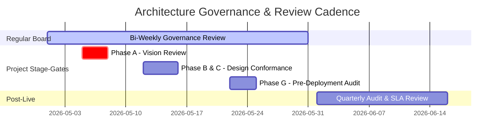
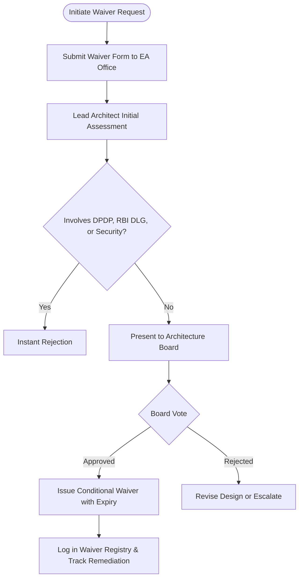

# TOGAF Preliminary Phase: Architecture Board Charter & Governance Framework

This document outlines the **Architecture Governance Framework** and the **Architecture Board Charter** for NextGen Bank's **Digital Lending Unit (DLU)**, specifically governing the **Straight-Through Processing (STP) Micro-Loan Mobile Platform**.

---

## 1. Mission and Objectives

The NextGen Bank Architecture Board (AB) is established as the governing authority to ensure all digital lending systems, platforms, and integrations are aligned with the bank’s strategic goals, security protocols, regulatory frameworks, and architecture principles.

### Key Objectives:
*   **Strategic Alignment**: Ensure all technical implementations align with the **STP-First**, **API-First**, and **Mobile-First** strategy.
*   **Regulatory Conformance**: Enforce strict adherence to the **Reserve Bank of India (RBI) Digital Lending Guidelines (DLG)** and the **Digital Personal Data Protection (DPDP) Act**.
*   **Technical Debt Management**: Mitigate long-term operational liabilities by controlling software duplication, architectural deviations, and legacy workarounds.
*   **Interoperability**: Standardize internal microservices and external interfaces (India Stack, Account Aggregator, NPCI, e-Sign).

---

## 2. Terms of Reference (ToR)

### 2.1 Scope of Authority
The Architecture Board holds authority over all technology acquisitions, software designs, data schemas, cloud infrastructure, and partner integration architectures within the Digital Lending Unit (DLU). No system can proceed to Phase G (Implementation Governance) without a formal sign-off from this Board.

### 2.2 Board Composition & Roles
The board is cross-functional, comprising representation from business, technology, security, and compliance:

| Role on Board | Representative Title | Key Responsibility |
| :--- | :--- | :--- |
| **Board Chairperson** | Chief Enterprise Architect (EA) | Directs the board, schedules reviews, and makes tie-breaking decisions. |
| **Technology Sponsor** | Chief Technology Officer (CTO) | Represents infrastructure capacity, cloud budget, and engineering feasibility. |
| **Business Sponsor** | Head of Digital Lending Unit (DLU) | Represents business targets, loan volume KPIs, and customer acquisition goals. |
| **Security Authority** | Chief Information Security Officer (CISO) | Enforces DevSecOps pipelines, encryption key management (KMS), and threat models. |
| **Compliance Authority** | Chief Compliance Officer (CCO) | Audits KYC, AML, Consent registries, and direct fund flow compliance. |
| **Data Authority** | Principal Data Architect | Governs schema definitions, data lake segregation, PII tokenization, and analytics. |
| **Operations Observer** | Head of Financial Operations | Monitored-only seat to track end-of-day reconciliation workflows and CBS sync. |

### 2.3 Voting, Quorum, and Escalation Path
*   **Quorum**: A minimum of four (4) voting members must be present, which must include the Chairperson, the CISO (or representative), and the CCO (or representative).
*   **Voting**: Decisions are ideally reached by consensus. If a vote is required, a simple majority rules, provided the Chairperson is in the majority.
*   **Escalation Path**: If a decision cannot be resolved or is vetoed by the Business or Security sponsor due to critical blockers:
    1.  The issue is formally documented in the Architecture Registry.
    2.  Escalated to the Chief Executive Officer (CEO) and Chief Risk Officer (CRO) for executive arbitration.
    3.  The executive decision is recorded and appended to the Architecture Contract.

---

## 3. Architecture Review Cadence

The Architecture Board maintains a strict cadence of meetings to align with fast-paced digital delivery cycles:



### 3.1 Review Types and Triggers:
1.  **Bi-Weekly Architecture Alignment**: Routine monitoring of implementation sprints, technical debt registry, and minor schema changes.
2.  **Stage-Gate Reviews**: Mandatory reviews at key ADM transition boundaries (e.g., transitioning from Phase B/C Design to Phase G Implementation).
3.  **Ad-Hoc Waiver Sessions**: Triggered within 48 hours of a formal waiver request filed by a project team due to emergency vendor outages or technical blocks.
4.  **Quarterly Compliance & Performance Audit**: Joint review with the Risk Committee to evaluate scorecard drift, API response latencies, and DPDP compliance logs.

---

## 4. Architecture Waiver Process

An architecture waiver is a formal temporary or permanent authorization to deviate from established architectural standards or principles. For the STP Micro-Loan platform, deviations from security or compliance (DPDP/RBI DLG) are strictly ineligible for waivers.



### Waiver Lifecycle Phases:
1.  **Request Submission**: The project lead submits a detailed form detailing the target standard, rationale for deviation, duration, security mitigation steps, and a remediation plan to restore compliance.
2.  **Impact Assessment**: A designated Enterprise Architect evaluates the risk exposure, technical debt footprint, and downstream API impacts.
3.  **Board Review**: The request is presented at the next board session (or ad-hoc meeting). The submitter defends the business necessity.
4.  **Decision & Tracking**: Approved waivers are assigned a unique ID (e.g., `WAV-2026-001`), logged in the Waiver Registry, and given a hard expiration date (maximum 180 days).
5.  **Remediation & Closure**: The project team must implement the remediation plan before the waiver expires. Failure to do so halts next-phase stage-gate approvals.

---

## 5. Approval Criteria

The Architecture Board evaluates all systems, modifications, and integrations against four primary conformance pillars:

```
┌─────────────────────────────────────────────────────────────────────────┐
│                     ARCHITECTURAL APPROVAL MATRIX                       │
├─────────────────┬───────────────────────────────────────────────────────┤
│ Pillar          │ Core Conformance Requirements                         │
├─────────────────┼───────────────────────────────────────────────────────┤
│ Regulatory      │ - 100% compliance with RBI DLG (Direct Fund Flow).   │
│ Conformance     │ - Explicit, granular Consent architecture (DPDP Act). │
│                 │ - Automated audit trail creation for every API call.  │
├─────────────────┼───────────────────────────────────────────────────────┤
│ Security        │ - Key Management System (KMS) for data encryption.    │
│ & Privacy       │ - OAuth2/OIDC token-based access control.             │
│                 │ - No PII exposure in logs; tokenized database storage.│
├─────────────────┼───────────────────────────────────────────────────────┤
│ Engineering     │ - REST/gRPC API compliance with OpenAPI guidelines.   │
│ Standards       │ - Strict microservices isolation; decoupled databases.│
│                 │ - CI/CD automated test coverage exceeding 85%.       │
├─────────────────┼───────────────────────────────────────────────────────┤
│ Performance     │ - End-to-end STP loan processing under 5 minutes.     │
│ & Resilience    │ - Max API gateway latency under 200 milliseconds.     │
│                 │ - Fallbacks and circuit-breakers for third-party APIs.│
└─────────────────┴───────────────────────────────────────────────────────┘
```

---

## 6. Governance Templates

### 6.1 Architecture Conformance Checklist (Sample)
Project teams must submit this completed checklist during Stage-Gate reviews:

- [ ] **STP-First**: Does the system workflow exclude manual intervention screens or back-office tasks?
- [ ] **Data Locality**: Are all PII elements stored exclusively in the tokenized User DB?
- [ ] **Consent Verification**: Does the workflow verify active Consent Registry tokens before invoking third-party data APIs?
- [ ] **Direct Funding Flow**: Are funds routed directly from NextGen Bank’s pool to the borrower's verified bank account without intermediaries?
- [ ] **Resilience Checklist**: Are circuit breakers configured for the Credit Bureau, Aadhaar e-KYC, and NPCI gateways?

### 6.2 Waiver Request Template (Schema)
*   **Waiver ID**: `WAV-YYYY-XXXX` (Assigned by EA Office)
*   **Title**: Short description of the waiver.
*   **Requesting System/Module**: e.g., Onboarding Service, Scorecard Engine.
*   **Standard Deviated From**: e.g., "Standard API Gateway latency must be < 200ms."
*   **Business Rationale**: Detailed explanation of why the standard cannot be met.
*   **Risk & Security Impact Analysis**: What risks are introduced? How are they mitigated?
*   **Remediation Plan**: Timeline and technical steps to restore alignment.
*   **Expiration Date**: Day when the waiver ceases to be valid.
