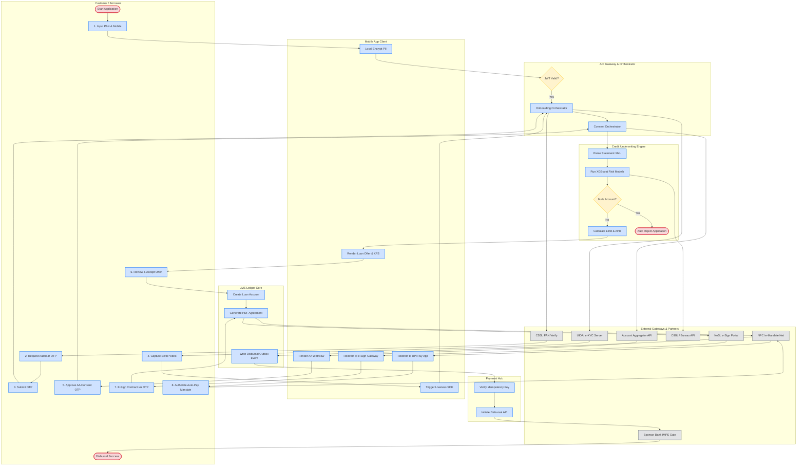
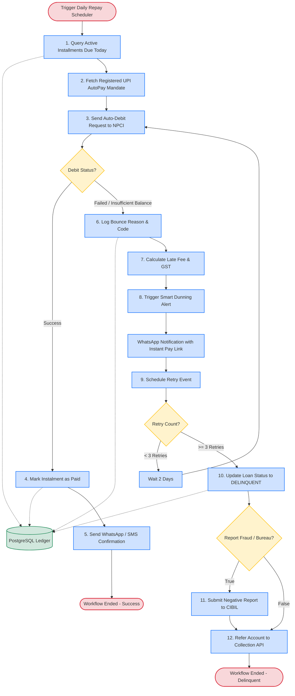
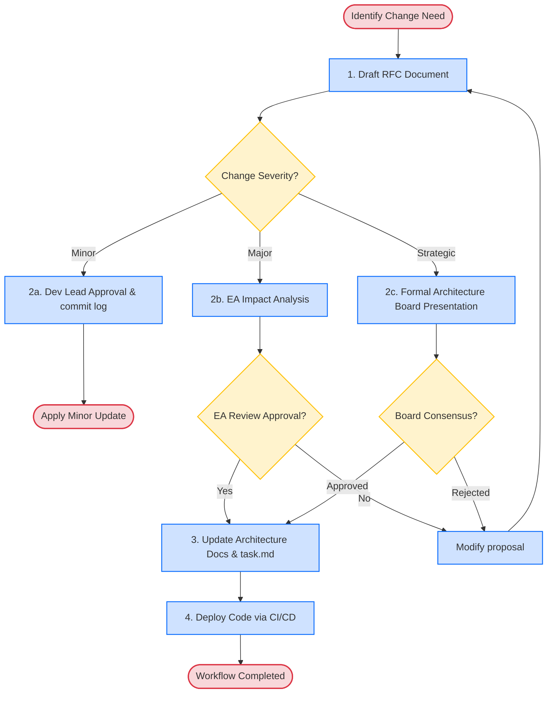
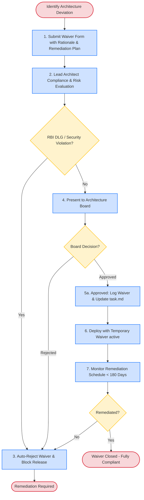

# TOGAF BPMN & Process Models Repository

This document contains the core **BPMN-aligned Process Models** and flowcharts for NextGen Bank's **STP Micro-Loan Mobile Platform**. The models are represented using standard Mermaid diagram syntax, dividing workflows into clear swimlanes, tasks, decision gateways, and external integrations to provide implementation teams with a blueprint for execution.

---

## 1. Master STP Loan Origination & Disbursal Process

This swimlane-based process model illustrates the end-to-end straight-through processing lifecycle of a loan, mapping tasks across the Customer, internal microservices, and external India Stack partners.

---

## 2. Automated Repayment & Exception Collection Process

This flowchart details the daily lifecycle of automated repayment collections, detailing error handling and the smart dunning trigger mechanisms when payments bounce.

---

## 3. Architecture Change Management (RFC) Lifecycle

This diagram details the governance workflow for Request for Architecture Change (RFC) files. It distinguishes between Minor, Major, and Strategic shifts.

---

## 4. Architecture Waiver Management Workflow

This flowchart maps the process of submitting, evaluating, approving, and auditing architecture waivers.

