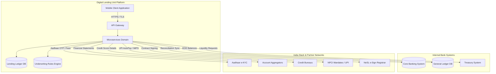

# TOGAF Phase A: Architecture Vision

This document details the **Architecture Vision** for NextGen Bank's **Straight-Through Processing (STP) Micro-Loan Mobile Platform**. It defines the architectural boundaries, system boundaries, target-state characteristics, and value proposition of the digital lending system.

---

## 1. Project Context & Objectives

NextGen Bank aims to launch a digital-first, instant micro-lending solution (loans up to 10 Lakh INR) targeting Gen-Z and Millennial customers. To achieve commercial success, the platform must deliver an onboarding-to-disbursal experience in under 5 minutes. The architectural vision enables this by deploying a fully automated, cloud-native, zero-human-intervention pipeline.

### Strategic Goals:
*   **Customer Acquisition Cost (CAC)**: Minimize CAC by automating e-KYC, underwriting, and contracts.
*   **Operating Ratio**: Maintain a flat operational headcount while scaling loan volumes exponentially.
*   **Credit Quality**: Implement automated fraud checks and real-time financial transaction analytics to control credit defaults.

---

## 2. Architecture Vision Scope

Defining boundaries ensures the engineering teams remain focused on the digital micro-loan system without altering legacy core banking architectures.

```
┌─────────────────────────────────────────────────────────────────────────────┐
│                            ARCHITECTURE BOUNDARY                            │
├──────────────────────────────────────────┬──────────────────────────────────┤
│ IN-SCOPE                                 │ OUT-OF-SCOPE                     │
├──────────────────────────────────────────┼──────────────────────────────────┤
│ - Native iOS & Android client apps.      │ - Physical branch kiosks or      │
│ - Middle-tier microservices orchestration│   manual application interfaces. │
│ - In-house Credit Underwriting Engine.   │ - Legacy Core Banking (CBS) database│
│ - Dedicated, low-latency Lending Ledger. │   modifications.                 │
│ - India Stack integrations (eKYC,        │ - Secured, asset-backed lending  │
│   eSign, NPCI AutoPay, AA).              │   (e.g., gold or auto loans).    │
│ - Encryption key custody & management.   │ - Long-term corporate commercial │
│ - Tokenized PII data stores.             │   credit lines.                  │
└──────────────────────────────────────────┴──────────────────────────────────┘
```

---

## 3. Boundary Map & System Context

The boundary map illustrates how the Digital Lending Unit (DLU) interfaces with the internal bank systems and external public infrastructure.



---

## 4. Target-State Architecture Description

The target state architecture is structured across the four core TOGAF ADM domains:

### 4.1 Business Architecture
*   **Fully Automated Workflows**: All business processes from registration to disbursement are structured as asynchronous orchestrations. There are no operational data-entry screens.
*   **Dynamic Exception Handling**: Instead of routing errors to manual processors, exceptions (like API timeouts) trigger automated client-side retries, SMS alerts, or graceful fallbacks.
*   **Granular Consent Logging**: Compliance is verified programmatically; no data is retrieved or stored without a cryptographically signed consent token.

### 4.2 Data Architecture
*   **PII Tokenization**: Raw Aadhaar, PAN, and phone numbers are stored in a secure vault. Internal services refer to users via synthetic IDs (tokens), reducing data-leak risk.
*   **Data Minimization & Purging**: Underwriting data (bank statements fetched via AA) is marked as transient. It is cached for evaluation and automatically purged 30 days post-decision, maintaining compliance with the DPDP Act.
*   **Double-Entry Ledger**: The platform maintains a localized sub-ledger database optimized for real-time interest accruals and transaction logging, separating transactional analytics from the bank's legacy CBS database.

### 4.3 Application Architecture
*   **Microservices Pattern**: Decoupled services organized by business capabilities (Onboarding, Consent, Risk, Payment, Ledger).
*   **Event-Driven Communication**: Core state changes (e.g., Loan Approved) are published to a distributed message broker (Kafka), allowing downstream systems (e-Sign, Mandate) to consume updates asynchronously.
*   **Server-Driven UI (SDUI)**: Mobile interfaces are constructed dynamically from backend configuration payloads, allowing immediate product parameter updates (e.g., interest rates, fee displays) without releasing client-side updates.

### 4.4 Technology Architecture
*   **Cloud-Native Containerization**: Services run as containers in a Managed Kubernetes cluster, utilizing auto-scaling groups to manage peak loan demands during digital marketing campaigns.
*   **Zero-Trust Network**: Deployment of a Service Mesh (Istio) enforcing mutual TLS (mTLS) for all service-to-service communication.
*   **Hardware Security Module (HSM) Integration**: Cryptographic keys for signing loan agreements and encrypting databases are stored in dedicated Cloud KMS/HSM instances.

---

## 5. Architecture Value Proposition

### 5.1 Business Metrics & KPIs:
*   **Decision Speed**: Customer time-to-offer < 60 seconds; complete onboarding-to-disbursal < 5 minutes.
*   **Friction Reduction**: Goal of < 15% drop-off rate across the onboarding funnel.
*   **Cost Efficiency**: Customer Acquisition Cost (CAC) targeted at < 200 INR per active borrower.
*   **Technical Uptime**: API gateway availability SLA at 99.99%.

### 5.2 Architecture Risks & Mitigations:

| Risk Description | Impact | Probability | Mitigation Strategy |
| :--- | :--- | :--- | :--- |
| **Partner API Downtime** (e.g., UIDAI e-KYC or NPCI e-Mandate down). | High | High | Implement local caching of non-PII payloads, circuit breakers, and automated client SMS notifications to resume later. |
| **Credit Underwriting Model Bias** (Scorecard errors leading to high FPD defaults). | High | Medium | Deploy a shadow scoring engine to run model variations alongside production, feeding results to a data lake for CRO audits. |
| **Data Leak of PII** (Breach of customer data violating DPDP Act). | Critical | Low | Strict tokenization of PII at edge ingress; database-level encryption with customer-specific KMS keys; no raw PII in application log fields. |
| **CBS Transaction Latency** (Legacy banking core delays disbursals). | Medium | High | Decouple payments using an asynchronous Payment Hub with retry queues; buffer ledger entries on the DLU sub-ledger. |
