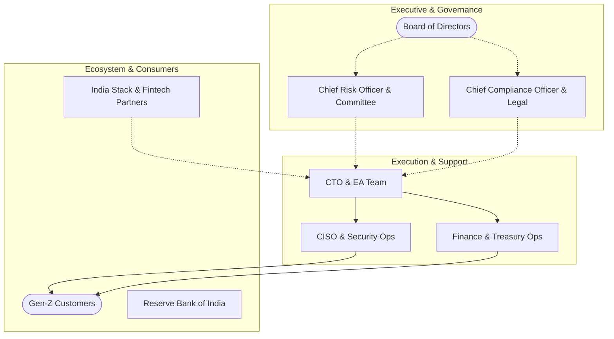
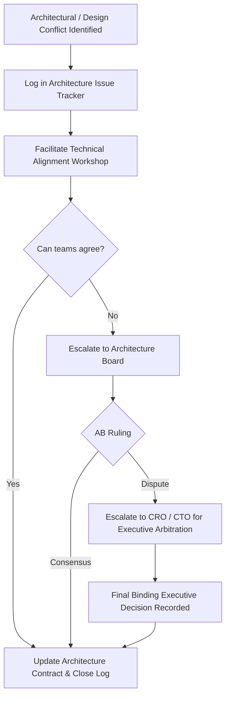

# TOGAF Phase A: Stakeholder Management Plan

This document details the **Stakeholder Map, Engagement Matrix, and Communications Plan** for NextGen Bank's **STP Micro-Loan Mobile Platform**. Managing stakeholders is critical to ensuring smooth project execution, maintaining compliance, and achieving fast-paced delivery.

---

## 1. Stakeholder Map

The stakeholders for the digital lending platform span internal executive leadership, operational teams, external technology partners, regulators, and end customers.



### Stakeholder Profiles:
1.  **Board of Directors**: Focuses on commercial viability, capital allocation, ROI, and brand reputation. They want to ensure the platform captures market share without breaching risk limits.
2.  **Chief Risk Officer (CRO) & Risk Committee**: Responsible for default rates, credit policy updates, and fraud losses. They monitor credit scorecards and underwriting engine parameters.
3.  **Chief Compliance Officer (CCO) & Legal**: Enforces regulatory compliance (RBI DLG, DPDP Act, AML regulations). They require audit trails, consent records, and proof of direct fund flow.
4.  **Chief Technology Officer (CTO) & EA Team**: Governs application architecture, cloud costs, system scalability, API standards, and developer productivity.
5.  **Chief Information Security Officer (CISO) & Security Operations**: Protects against customer data leaks, API vulnerabilities, DDoS attacks, and key management compromises.
6.  **Customer Segment (Gen-Z Borrowers)**: The end-users of the mobile app. Their primary interest is instant speed, low-latency, transparent pricing, and responsive support.
7.  **Finance & Treasury Operations**: Oversees cash flows, liquidity management, fund settlement, and daily reconciliation between the lending ledger and the Core Banking System.
8.  **Ecosystem Partners**: Integrators for Aadhaar, Account Aggregators, Credit Bureaus, payment networks (NPCI), and e-sign gateways. They want clear API specifications and reliable traffic volumes.

---

## 2. Power / Interest Grid

To optimize communication overhead, stakeholders are mapped onto a standard Power/Interest Matrix:

```
                  High Power / Low Interest         High Power / High Interest
                ┌───────────────────────────────┬───────────────────────────────┐
                │                               │                               │
                │   * Chief Compliance Officer  │   * Chief Risk Officer (CRO)  │
                │   * Board of Directors        │   * Chief Technology Officer  │
                │                               │   * Chief Info Security Officer│
      P         │                               │                               │
      O         ├───────────────────────────────┼───────────────────────────────┤
      W         │                               │                               │
      E         │   * Finance & Treasury Ops    │   * Gen-Z Customers           │
      R         │   * Partners (NPCI, UIDAI)    │   * Digital Lending Unit      │
                │                               │                               │
                │                               │                               │
                └───────────────────────────────┴───────────────────────────────┘
                                                  Low Power / High Interest
                                INTEREST ────>
```

---

## 3. Stakeholder Engagement Matrix

| Stakeholder Group | Current Stance | Target Stance | Key Concerns & Requirements | Engagement Strategy | Key Deliverables of Interest |
| :--- | :--- | :--- | :--- | :--- | :--- |
| **Board of Directors** | Support | Champion | ROI, project milestones, market positioning, regulatory risks. | Quarterly briefing sessions, executive dashboard updates. | Statement of Architecture Work, Migration Roadmap. |
| **Chief Risk Officer** | Neutral | Support | Portfolio default rates (NPA), underwriting logic drift, fraud. | Bi-weekly credit policy alignment workshops, sharing scorecard testing results. | Credit Scorecard Engine Specs, Fraud Analytics Logs. |
| **Chief Compliance Officer**| Neutral | Champion | RBI Digital Lending Guidelines, DPDP consent tracking, KYC audits. | Weekly reviews of compliance dashboards, consent logs, and direct fund flow routing. | Consent Registry Architecture, Regulatory Mapping. |
| **Chief Technology Officer**| Champion | Champion | Technical debt, API scalability, infrastructure cost, microservices complexity. | Active participation in the Architecture Board, standard-gate reviews. | Application & Technology Architecture, ABBs. |
| **Chief Info Security Officer**| Neutral | Champion | PII data encryption, KMS key management, API security, DDOS vulnerability. | Collaborative threat modeling, monthly penetration testing review sessions. | Key Management Policy, Security Architecture. |
| **Gen-Z Customers** | Neutral | Champion | App loading speed, UX simplicity, pricing clarity, instant support. | User testing panels, real-time feedback loops, app usage telemetry analysis. | Customer Journey Map, Mobile Screen Mockups. |
| **Finance Operations** | Neutral | Support | Daily reconciliation accuracy, IMPS/UPI transaction failures, liquidity levels. | Weekly ops alignment meetings, automating EOD batch reconciliation jobs. | Ledger Architecture, Reconciliations workflow. |
| **Ecosystem Partners** | Neutral | Support | Integration latencies, SLA maintenance, rate limits, sandbox availability. | Developer support portal, standard API contract reviews, shared SLA dashboards. | API Gateway Specs, Service Level Agreements. |

---

## 4. Communication Plan & Requirements

To manage stakeholder expectations efficiently, specific communications channels and cadences are established:

```
┌───────────────────────────────────────────────────────────────────────────────┐
│                           COMMUNICATIONS MATRIX                               │
├─────────────────┬───────────┬───────────────┬─────────────────────────────────┤
│ Audience        │ Frequency │ Channel       │ Format & Key Content            │
├─────────────────┼───────────┼───────────────┼─────────────────────────────────┤
│ Board           │ Quarterly │ Executive     │ slide deck summary of market    │
│                 │           │ Meeting       │ share, portfolio health, budget.│
├─────────────────┼───────────┼───────────────┼─────────────────────────────────┤
│ Risk &          │ Bi-Weekly │ Working       │ scorecard drift reports, fraud  │
│ Compliance      │           │ Committee     │ alerts, consent audit records.  │
├─────────────────┼───────────┼───────────────┼─────────────────────────────────┤
│ CTO & CISO      │ Weekly    │ Tech Lead     │ Sprint metrics, security threat │
│                 │           │ Sync          │ models, API gateway metrics.    │
├─────────────────┼───────────┼───────────────┼─────────────────────────────────┤
│ Development     │ Daily     │ Standup &     │ Jira board, Slack channels,     │
│ Teams           │           │ Git Reviews   │ architecture documentation logs.│
├─────────────────┼───────────┼───────────────┼─────────────────────────────────┤
│ End Customers   │ Continuous│ Mobile App,   │ In-app banners, push alerts,    │
│                 │           │ Email, SMS    │ dynamic pricing notifications.  │
└─────────────────┴───────────┴───────────────┴─────────────────────────────────┘
```

### 4.1 Reporting and Escalation Flow:
1.  **System Outage/Alerts**: Direct API webhook alerts routed to the platform reliability engineering (SRE) Slack channel. Major partner outages (Aadhaar or NPCI) automatically notify the Operations team and trigger dynamic UI warnings on the mobile app.
2.  **Security Events**: High-priority alerts from the CISO's SIEM system route directly to the security incident response team and the CTO.
3.  **Waiver Escalation**: Initiated when a stream team cannot meet standard latency or architectural criteria. Formal review by the Architecture Board within 4 days.

---

## 5. Conflict Resolution Workflow

Architectural design conflicts frequently arise between delivery speed, security controls, and risk policies. The following workflow manages these trade-offs:


