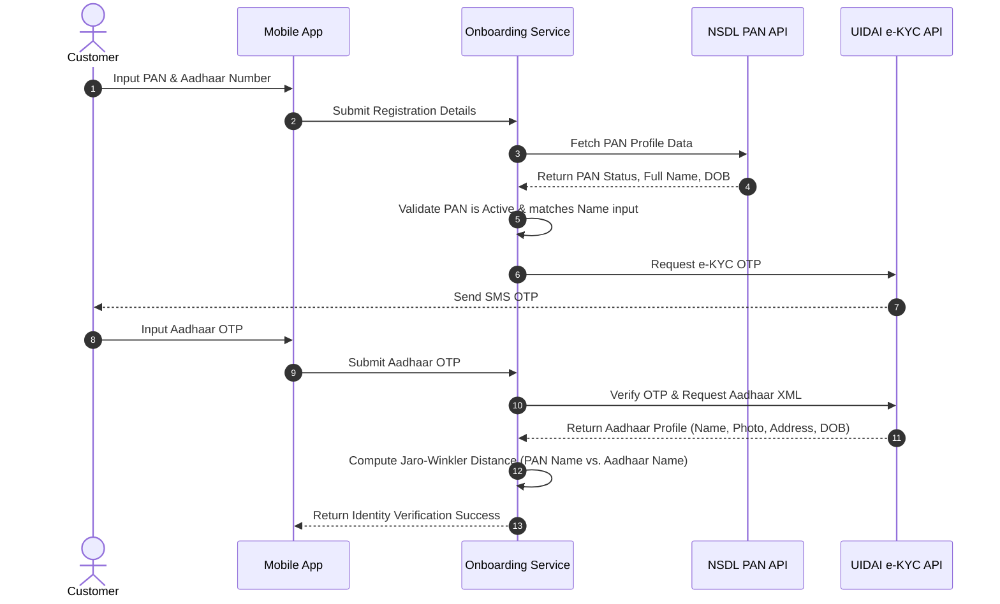
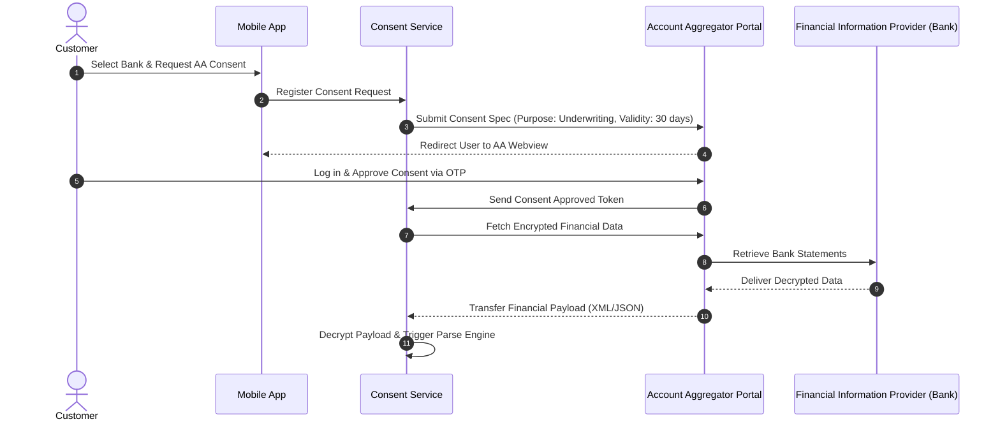
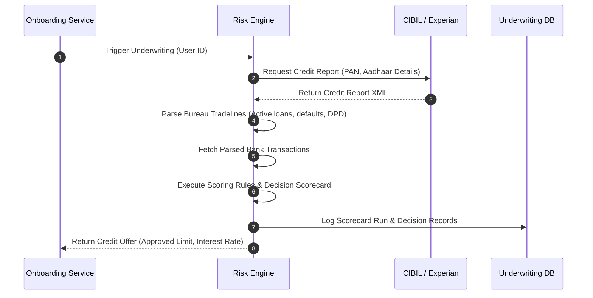
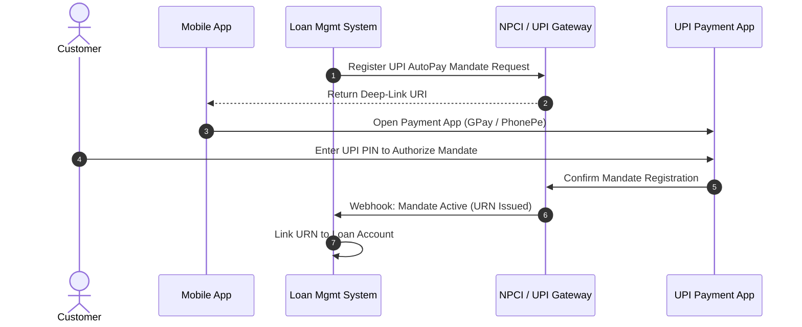
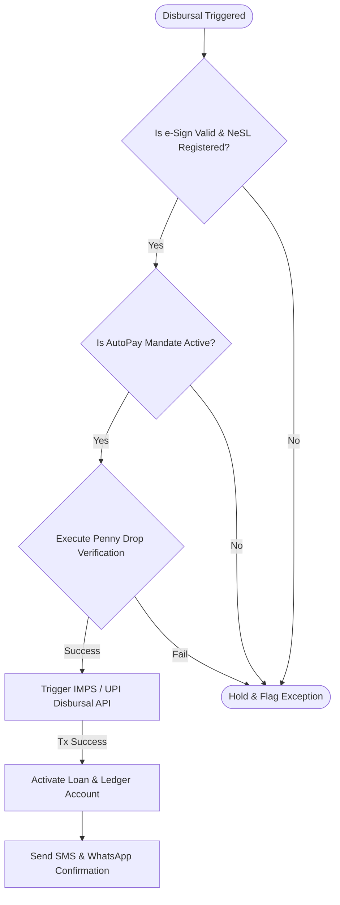

# TOGAF Phase B: Straight-Through Processing Business Workflows

This document provides a detailed specification of the six core **Straight-Through Processing (STP) Workflows** that automate the entire lending lifecycle. Each workflow describes the sequence of API interactions, business validation rules, and system behavior.

---

## 1. Identity Verification & KYC Process

This process validates the borrower's identity and performs regulatory Know-Your-Customer checks using Aadhaar e-KYC, NSDL PAN verification, and video face matching.

### Key Business Rules & Checks:
*   **PAN Validity**: The PAN status returned by NSDL must be active. Deceased or inactive PAN entries trigger immediate rejection.
*   **Name Matching (Jaro-Winkler)**: Because spelling variations occur between PAN and Aadhaar, the system calculates a name match confidence score. If the Jaro-Winkler distance is **< 0.85**, the application is routed to automated rejection.
*   **Age Restriction**: System validates that the date of birth (DOB) returned by Aadhaar confirms the customer's age is between 18 and 35.

---

## 2. Account Aggregator (AA) Consent & Financial Fetch

This process orchestrates the consent-driven collection of the customer's historical bank statements in compliance with the RBI Data Empowerment and Protection Architecture (DEPA) framework.

### Technical Workflow Details:
1.  **Consent Spec**: The request specifies a strict data-use scope: Bank Statements for the last 6 months. Data fetch is defined as a one-time pull.
2.  **Encryption**: FIP data is encrypted end-to-end using a dynamic key pair. The Account Aggregator acts as a router; it cannot decrypt or view the payload. The decryption key resides exclusively inside NextGen Bank's **Consent Service**.
3.  **Parsing Engine**: Converts raw transaction XML/JSON schemas from various banks into a standardized transaction model (dates, amounts, narrative tokens).

---

## 3. Bureau Scraping & Credit Scorecard Evaluation

This process retrieves credit history from authorized bureaus and executes the underwriting model to approve a credit limit.

### Underwriting Scorecard Rules:
*   **Bureau Score Filter**: Minimum CIBIL score must be **>= 650**. Customers with lower scores are automatically rejected.
*   **Days Past Due (DPD) Check**: No trade-line can display a DPD value **> 30** within the past 12 months.
*   **Income Verification**: Automated transaction analyzer calculates the average monthly income based on salary salary narratives or consistent deposits.
*   **Debt Service Coverage Ratio (DSCR)**: The calculated monthly EMI for the approved loan limit must not exceed **45%** of the estimated monthly income.

---

## 4. Repayment Mandate Registration (Auto-Debit)

To ensure low credit losses, the loan cannot be disbursed until a binding auto-repayment mandate is registered with the National Payments Corporation of India (NPCI).

### Mandate Rules:
*   **Mandate Limit**: The mandate is registered for an amount equal to the maximum monthly EMI (plus a 10% safety buffer for late charges).
*   **Bank Account Match**: The bank account registered for the mandate must match the destination bank account verified during the onboarding process.
*   **Alternative Flow**: If UPI AutoPay fails, the system renders an e-NACH registration screen requiring NetBanking or Debit Card OTP authentication.

---

## 5. Loan Agreement Assembly & Aadhaar e-Sign

This process generates the legal contract, displays it to the customer, and registers a digitally signed version with national vaults.

### Workflow Steps:
1.  **Contract Assembly**: The **Loan Management System (LMS)** fetches the customer profile (name, address, PAN), loan parameters (amount, interest, tenure, APR), and Key Fact Statement (KFS) details. These are merged into a standardized PDF/A template.
2.  **e-Sign API Trigger**: The generated document is sent to an authorized e-Sign gateway provider (e.g., NSDL or CDSL).
3.  **Customer Authentication**: The app redirects the user to the secure e-Sign page where they enter their Aadhaar number and the mobile OTP.
4.  **Verification**: The gateway validates the Aadhaar signature against UIDAI databases, signs the PDF, and returns the digitally signed contract along with a cryptographic audit trail.
5.  **NeSL Registration**: The signed agreement is registered with National E-Governance Services Limited (NeSL) as legal evidence of the debt.

---

## 6. Automated Fund Disbursal Release

The final step releases the loan funds directly to the customer's bank account. This is executed only after all validation checks have passed.

### Disbursal Checks:
*   **Penny Drop Verification**: A small amount (e.g., 1 INR) is transferred to the destination bank account. The API returns the beneficiary name registered at the bank. The system matches this beneficiary name against the Aadhaar/PAN verified name. If the name match score is below 90%, disbursal is halted.
*   **Payment Hub Routing**: Disbursal is routed through NextGen Bank’s real-time payment hub. High-priority routing utilizes **IMPS** (Immediate Payment Service) or **UPI** for sub-second settlement.
*   **Ledger Activation**: Upon receiving a successful transaction callback from the payment hub, the loan status is updated to `ACTIVE` in the lending ledger database, and the repayment schedule is activated.
