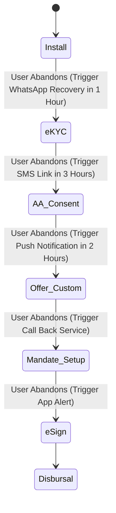

# TOGAF Phase B: Customer Journey & STP UX Architecture

This document defines the **Customer Journey, User Experience (UX) Architecture, and Straight-Through Processing (STP) Exception Routing** for NextGen Bank's micro-loan mobile application. It details how the frontend UI and backend state machines interact to guide the user from installation to disbursal with zero human intervention.

---

## 1. Customer Journey Touchpoints

The customer journey is divided into seven sequential stages. Each stage is fully digital, requiring zero physical paperwork or manual verification.

```
┌───────┐     ┌───────┐     ┌───────┐     ┌───────┐     ┌───────┐     ┌───────┐     ┌───────┐
│ Install │ ──> │ e-KYC │ ──> │ Bank  │ ──> │ Offer │ ──> │AutoPay│ ──> │e-Sign │ ──> │ Funds │
│ & OTP │     │& PAN  │     │Consent│     │Custom │     │Mandate│     │ Agree │     │ Releas│
└───────┘     └───────┘     └───────┘     └───────┘     └───────┘     └───────┘     └───────┘
```

1.  **Install & OTP Verification**: The user downloads the app, enters their mobile number, and validates it using a secure SMS OTP.
2.  **e-KYC & identity Verification**: Customer inputs their PAN and Aadhaar number. A biometric liveness camera check validates identity.
3.  **Bank Transaction Consent**: The app redirects the user to the licensed Account Aggregator portal to approve financial statement sharing.
4.  **Offer Customization**: Approved users view their credit limit and adjust terms (tenure, amount) using dynamic sliders.
5.  **AutoPay Mandate Setup**: User registers a UPI AutoPay or e-NACH mandate to enable automatic monthly EMI debits.
6.  **e-Sign Agreement**: User signs the customized loan agreement digitally via an Aadhaar-linked OTP signature.
7.  **Disbursal Release**: The loan amount is released directly to the borrower's verified bank account via IMPS/UPI.

---

## 2. Server-Driven UI (SDUI) Flow

To support rapid product updates without releasing new mobile app binaries, the application utilizes a Server-Driven UI layout.

### SDUI Payload Architecture:
*   The mobile app acts as an interpreter of standardized JSON layouts received from the **Onboarding Service**.
*   The backend determines which screen to show based on the user's current state in the database.
*   *Example SDUI Payload structure*:
    ```json
    {
      "screen_id": "OFFER_SCREEN",
      "navigation": {
        "next": "/pay/register-mandate",
        "back": "/consent/aa-status"
      },
      "components": [
        { "type": "Header", "properties": { "text": "Congratulations, Rahul!" } },
        { "type": "Slider", "properties": { "min": 10000, "max": 200000, "step": 5000, "key": "loan_amount" } },
        { "type": "KFS_Widget", "properties": { "apr_key": "apr", "fees_key": "fees" } },
        { "type": "Button", "properties": { "label": "Accept & Register Auto-Pay", "action": "SUBMIT" } }
      ]
    }
    ```

---

## 3. Biometric Liveness Check UX Flow

To combat spoofing and identity theft, the app requires a video liveness check.

### UX Flow Steps:
1.  **Preparation Overlay**: Clear visual guidelines displaying how to align the face inside the circular boundary. Instructions remind the user to remove glasses and hats, and sit in a well-lit area.
2.  **Face Alignment**: A circular overlay is rendered on the screen. The boundary remains red until the face is properly aligned, turning green when ready.
3.  **Active Prompt Action**: To bypass static photo spoofing, the app triggers a random prompt (e.g., *"Please blink twice"* or *"Turn your head slightly right"*).
4.  **Real-Time Feedback**: A progress bar completes as the camera analyzes biometric markers.
5.  **Spoof Protection & Match**: The recorded video frame is processed on the backend liveness engine.
    *   *Success*: Seamless transition to the next step.
    *   *Failure*: Descriptive feedback is shown (e.g., *"Too dark"*, *"Face not centered"*), allowing up to 3 retries.

---

## 4. Consent UX & Compliance (DPDP & DEPA)

Consent UI screens must strictly comply with the Digital Personal Data Protection (DPDP) Act requirements for clear, granular, and revocable consent.

### UI Components for Consent:
*   **Explicit Checkboxes**: Consent options are unchecked by default. Blanket consent is prohibited.
*   **Plain Language Purpose**: A dedicated screen displays exactly what data is collected, why it is needed, and how long it is stored. (e.g., *"We access your bank transactions to calculate your credit limit. This data is deleted if your application is rejected."*).
*   **Privacy Statement Accordion**: Tap targets let users read the full privacy policy.
*   **Revocation Screen**: The in-app Account Settings screen includes a *"Manage Consents & Data"* option. Users can tap to revoke consent for promotional messages, third-party data tracking, or close their digital lending account (triggering an automated data purge workflow).

---

## 5. Exception Handling & STP Routing

To maintain a zero-human back-office, technical and process exceptions must be handled dynamically.

| Exception Scenario | Root Cause | Automated UI Response | STP Recovery Rerouting |
| :--- | :--- | :--- | :--- |
| **Aadhaar OTP Timeout** | UIDAI Server Lag | Displays "OTP Delayed" message with a 60-second countdown timer. | Offers user the option to switch to DigiLocker fetch or save session and retry via WhatsApp. |
| **PAN Verification Failure**| Name mismatch (NSDL vs. User Input) | Display "Name mismatch" alert. Prompts user to check input. | Executes fuzzy-match Jaro-Winkler analysis. If score is > 0.85, passes validation; else re-directs to manual scan upload. |
| **Account Aggregator Lag** | Consent request delay from FIP bank | Displays a loader: "Connecting with your bank. This can take up to 2 minutes." | Converts blocking UI into an asynchronous notification. User receives a push notification when data is loaded. |
| **Bureau Score Missing** | Customer has no formal credit history (New-to-Credit) | No error screen shown. Smooth transition to next step. | Routes user to a specialized "Micro-Scorecard" utilizing alternative data (AA transaction analysis and SMS telemetry). |
| **UPI Mandate Timeout** | User delayed opening payment app to approve AutoPay | Displays mandate expiration message with a link to trigger a new request. | Triggers a background SMS message with a direct deep-link to the payment app (GPay/PhonePe) to complete registration. |

---

## 6. Drop-off Recovery & Funnel Persistence

When users exit the app before disbursal, the platform executes automated recovery workflows:



### Funnel Recovery Policies:
1.  **State Persistence**: The **Onboarding Service** persists the user's progress. Upon re-opening the app, the client reads the persisted state from the database and loads the exact screen where the user left off.
2.  **Multi-Channel Notifications**:
    *   *Hour 1*: Send a friendly WhatsApp reminder with a deep-link back into the application.
    *   *Hour 4*: Send an SMS highlighting the approved loan limit (e.g., *"Your approved limit of 50,000 INR is waiting. Complete sign-up now."*).
    *   *Day 2*: Trigger an in-app push offer featuring a 10% discount on processing fees if they complete the loan setup.
3.  **Purge Trigger**: If the user does not resume onboarding within 7 days, the system automatically marks the application as abandoned, deletes all cached bank statements, logs the purge event in the Audit Trail, and notifies the customer via SMS.
