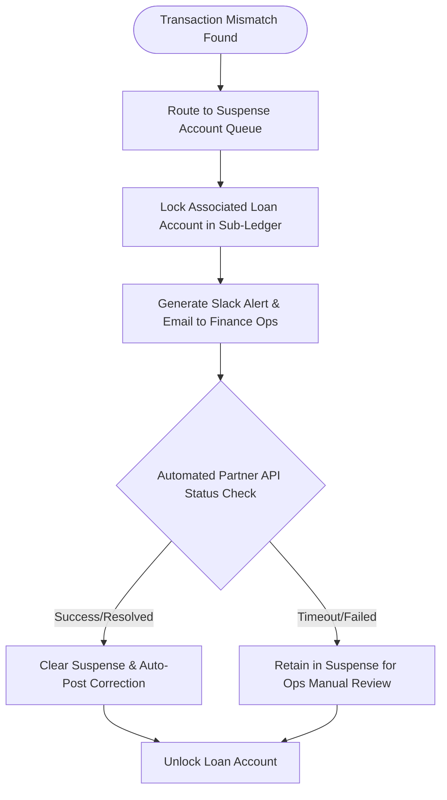

# Business Architecture: End-of-Day (EOD) Reconciliation & Settlement

This document defines the **Reconciliation and Settlement Architecture** governing the synchronization between NextGen Bank's digital micro-loan sub-ledger and the bank's legacy **Core Banking System (CBS)**.

---

## 1. Objectives

To prevent accounting discrepancies, double-postings, and audit failures, the platform enforces:
*   **Balance Accuracy**: Local sub-ledger aggregates must match the bank's General Ledger (GL) cash positions.
*   **Transaction Matching**: 100% of disbursals and repayments executed via payments networks must map to a unique loan transaction ID.
*   **Automated Suspense Handling**: Financial mismatches must trigger automated alarm queues rather than silent failures.

---

## 2. Daily Reconciliation Cycle Timeline

Reconciliation runs as an automated batch orchestration at the end of each business day:

```
    23:00 IST          23:15 IST             23:30 IST            00:00 IST
  ┌───────────┐      ┌───────────┐         ┌───────────┐        ┌───────────┐
  │ Ledger    │ ───> │ Fetch Bank│ ──────> │ Run Recon │ ─────> │ Post GL   │
  │ Cut-off   │      │ Statement │         │ Engine    │        │ Entries   │
  └───────────┘      └───────────┘         └───────────┘        └───────────┘
   Disable new        Retrieve IMPS         Match 1:1 transactions   Update Bank
   disbursals         & UPI logs            & flags discrepancies    GL accounts
```

---

## 3. Reconciliation Types

The platform implements two levels of reconciliation:

### 3.1 Transactional Reconciliation (1:1 Verification)
*   **Input**: Bank statement files (Host-to-Host SFTP) from the Sponsor Bank, and local Payment Hub logs.
*   **Process**: The Reconciliation Service matches each debit/credit entry using the unique **Payment Reference Number (UTR)**.
*   **Verification Rule**:
    $$\text{Status}_{\text{Transaction}} = \text{Success} \iff \text{PaymentHub}_{\text{Debit/Credit}} == \text{BankStatement}_{\text{Debit/Credit}}$$

### 3.2 Balance Reconciliation (Aggregate Verification)
*   **Input**: Lending Ledger ledger balances (Fineract DB) and CBS General Ledger GL balances.
*   **Process**: Verifies that the aggregate loan principal and interest totals calculated on the sub-ledger match the balance sheet ledger records in the CBS.
*   **Verification Rule**:
    $$\sum \text{SubLedger}_{\text{OutstandingPrincipal}} == \text{CBS\\_GL}_{\text{LendingAssetAccount}}$$

---

## 4. Exception & Dispute Handling

If a transaction fails to reconcile (e.g., UTR not found, value mismatch), it is automatically routed to the **Suspense Account Queue**:



### Dispute Categories & Automated Resolutions:
1.  **Double Debit on Repayment**: If a borrower's UPI auto-debit triggers twice, the system registers the second payment as a prepayment (reducing outstanding principal) and notifies the customer via WhatsApp with a refund/prepayment confirmation.
2.  **Delayed Disbursal**: If the IMPS network times out during disbursal, the Saga orchestrator halts ledger activation. If the bank logs show the funds were debited, the system initiates an automated rollback request to the Sponsor Bank.

---

## 5. Audit & Compliance Ledger Logging

*   **Immutable Hashing**: At the end of the reconciliation run, a cryptographic hash (SHA-256) of the EOD balance sheet is computed.
*   **Log Storage**: This hash is written to an immutable log directory and signed with the bank's HSM corporate key. This guarantees to external compliance auditors that ledger totals have not been altered post-reconciliation.
