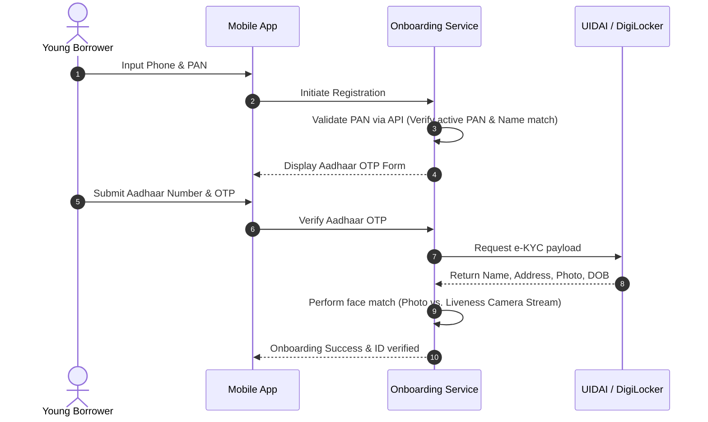
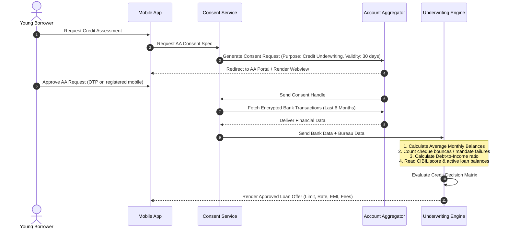
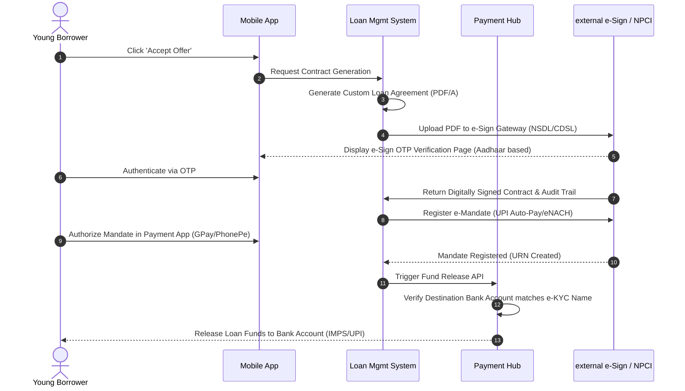

# TOGAF Phase B: Business Architecture

This document defines the **Business Architecture** for the mobile micro-loan platform. It establishes the business capabilities, the actors/roles, and the detailed, zero-human-intervention (STP) business processes.

---

## 1. Actors & Roles

To ensure compliance with the **STP-First** principle, human actors are restricted from operational loan execution. Human roles are limited to governance, risk policy configuration, and audit.

* **Borrower (Customer)**: The primary mobile user. Initiates applications, consents to data access, e-signs contracts, and authorizes auto-repayments.
* **Risk Policy Architect**: Bank employee who designs and updates the credit underwriting rules. Configures rule thresholds in the system but does not review individual loan files.
* **Compliance Auditor**: Bank or external employee who audits the digital logs, consent records, and regulatory reporting for compliance with DPDP and RBI guidelines.
* **Finance Operations (Ops)**: Bank employee who views system reconciliations and manages fund allocations. Has read-only access to transaction summaries.
* **Automated Credit Engine (Bot)**: The system actor that parses data, calculates risk scores, decides credit limits, and triggers disbursals/repayments.

---

## 2. Business Capability Map (Detailed)

```
NextGen Bank Digital Lending Capabilities
├── 1. Digital Acquisition & Onboarding
│   ├── Aadhaar e-KYC Verification
│   ├── PAN & Identity Check
│   └── Biometric Liveness Capture
├── 2. Consent & Data Gathering
│   ├── Account Aggregator (AA) Consent Lifecycle
│   ├── Device-Level Consent (SMS/Metadata for Fraud Prevention)
│   └── Consent Registry Audit Logging
├── 3. Automated Credit Decisioning
│   ├── Credit Bureau Scraping & Parsing
│   ├── Transaction Statement Analysis (Cash flow, balance, bounce history)
│   ├── Fraud Detection & Geofencing
│   └── Dynamic Credit Limits & Pricing Engine
├── 4. Loan Contract Management
│   ├── Automated Loan Agreement Assembly
│   ├── NeSL / e-Sign Gateway Orchestration
│   └── Digital Key Signing & Custody
├── 5. Automated Repayment Setup & Execution
│   ├── UPI Auto-Pay Registration
│   ├── e-NACH Mandate Processing (NPCI)
│   └── Auto-disbursal API Orchestration
└── 6. Automated Collections & Delinquency Management
    ├── AI-based Smart Dunning (SMS/WhatsApp notifications)
    ├── Mandate Execution Engine
    └── Delinquent Account Referral API
```

---

## 3. Straight-Through Processing (STP) Workflows

The business processes are broken down into sequential automated pipelines. If any pipeline step fails structural or risk checks, the process branches to automated rejection.

### 3.1 Customer Onboarding & KYC Pipeline


### 3.2 Automated Underwriting & Consent Pipeline


### 3.3 Loan Agreement e-Sign & Disbursal Pipeline


---

## 4. Business Architecture Building Blocks (BABBs)

Business Architecture Building Blocks define the logical business capabilities and standards.

### 4.1 Onboarding Management BABB
* **ID**: BABB-ONB-01
* **Description**: Orchestrates the verification of borrower identity, liveness, and contact points using India Stack integrations.
* **Associated Business Rules**:
  - Name mismatch between PAN and Aadhaar must not exceed a Jaro-Winkler distance threshold of 0.85.
  - Borrower age must be between 18 and 35.
  - Video liveness score must exceed 90%.

### 4.2 Consent Management BABB
* **ID**: BABB-CON-01
* **Description**: Ensures compliance with DPDP and DEPA specifications. Handles the creation, revocation, storage, and auditing of customer consents.
* **Associated Business Rules**:
  - Consents must have a strict expiration date.
  - Data gathered for credit underwriting must be purged 30 days after application rejection.
  - Users must be able to view and revoke active consent via the mobile app settings.

### 4.3 Credit Assessment BABB
* **ID**: BABB-CRD-01
* **Description**: Automates risk assessment by integrating external financial data sources and calculating credit scores.
* **Associated Business Rules**:
  - Minimum Bureau Score (CIBIL): 650.
  - Debt Service Coverage Ratio (DSCR) must be below 45% of verifiable monthly income.
  - Zero unpaid write-offs or defaults in the last 12 months.

### 4.4 Automated Repayment & Mandate BABB
* **ID**: BABB-PAY-01
* **Description**: Governs the setup and execution of the repayment mechanism and loan disbursals.
* **Associated Business Rules**:
  - Loan disbursals can only be initiated AFTER successful e-Sign and e-Mandate registration.
  - Disbursal destination account must be the same account registered for the e-Mandate.
