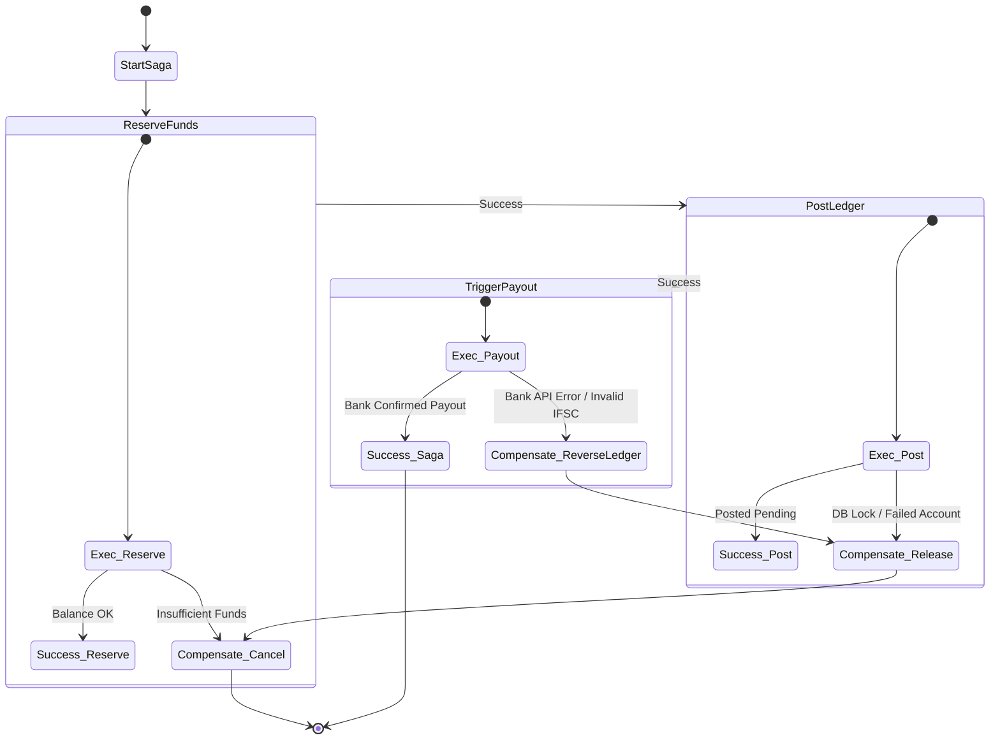

# Phase C: Application Architecture - Resilience & Patterns

This document details the software design patterns and implementation topologies used to guarantee system robustness, eventual consistency, and fault isolation across the distributed lending platform.

---

## 1. Circuit Breakers Configuration

To prevent cascading failures when invoking external APIs (such as credit bureaus, SMS gateways, and sponsor banks), the system uses **Resilience4j** (in Java/Spring Boot) and **Sony/gobreaker** (in Go).

### Configuration Standard

* **Failure Rate Threshold:** 50% (if 50% or more requests fail in a window, open the circuit).
* **Slow Call Rate Threshold:** 75% (calls taking longer than 1500ms are treated as slow; if 75% or more are slow, open the circuit).
* **Sliding Window Size:** 100 calls.
* **Minimum Number of Calls:** 20 calls (prevents opening circuit prematurely with too few data points).
* **Wait Duration in Open State:** 30 seconds (time before transition to Half-Open to test system recovery).
* **Max Allowed Calls in Half-Open:** 10 calls.

### Java (Resilience4j) YAML Configuration Snippet
```yaml
resilience4j.circuitbreaker:
  instances:
    sponsorBankService:
      slidingWindowType: COUNT_BASED
      slidingWindowSize: 100
      minimumNumberOfCalls: 20
      failureRateThreshold: 50
      slowCallRateThreshold: 75
      slowCallDurationThreshold: 1500ms
      waitDurationInOpenState: 30s
      permittedNumberOfCallsInHalfOpenState: 10
      automaticTransitionFromOpenToHalfOpenEnabled: true
      recordExceptions:
        - org.springframework.web.client.HttpServerErrorException
        - java.io.IOException
        - java.util.concurrent.TimeoutException
      ignoreExceptions:
        - org.springframework.web.client.HttpClientErrorException # 4xx shouldn't trip breaker
```

---

## 2. Transactional Outbox Pattern

To ensure atomic transactions between DB writes and Kafka message emission (avoiding two-phase commits), every service utilizes the **Transactional Outbox Pattern**.

```
   ┌────────────────────────────────────────┐
   │          Application DB                │
   │  ┌──────────────────┐                  │
   │  │  Business Table  │                  │
   │  └────────┬─────────┘                  │
   │           │ (Atomic Transaction)       │
   │  ┌────────▼─────────┐                  │
   │  │   outbox_events  │                  │
   │  └────────┬─────────┘                  │
   └───────────┼────────────────────────────┘
               │ (Reads periodically / Debezium CDC)
   ┌───────────▼─────────┐
   │  CDC Engine/Poller  │
   └───────────┬─────────┘
               │ (Publishes event)
   ┌───────────▼─────────┐
   │     Kafka Topic     │
   └─────────────────────┘
```

### Outbox DB Schema
```sql
CREATE TYPE outbox_status AS ENUM ('PENDING', 'PROCESSED', 'FAILED');

CREATE TABLE outbox_events (
    event_id UUID PRIMARY KEY DEFAULT gen_random_uuid(),
    aggregate_type VARCHAR(100) NOT NULL, -- e.g., 'LOAN_APPLICATION'
    aggregate_id VARCHAR(100) NOT NULL,   -- e.g., application_id
    event_type VARCHAR(100) NOT NULL,     -- e.g., 'APPLICATION_APPROVED'
    payload JSONB NOT NULL,
    status outbox_status NOT NULL DEFAULT 'PENDING',
    retry_count INT DEFAULT 0,
    created_at TIMESTAMP WITH TIME ZONE DEFAULT CURRENT_TIMESTAMP NOT NULL,
    processed_at TIMESTAMP WITH TIME ZONE
);

CREATE INDEX idx_outbox_pending ON outbox_events (status, created_at) WHERE status = 'PENDING';
```

### Debezium Outbox Polling Logic
We use **Debezium** to capture changes to the `outbox_events` table natively via PostgreSQL Replication Slots (Logical Decoding), converting rows to Kafka records instantly.

If Debezium is not utilized, the fallback is a Go-based database poller implementing SELECT FOR UPDATE SKIP LOCKED:

```go
func PublishPendingEvents(db *sql.DB, producer kafka.Producer) {
    tx, err := db.Begin()
    if err != nil {
        log.Fatal(err)
    }
    defer tx.Rollback()

    // Lock and retrieve pending events safely
    rows, err := tx.Query(`
        SELECT event_id, aggregate_type, event_type, payload 
        FROM outbox_events 
        WHERE status = 'PENDING' 
        ORDER BY created_at ASC 
        LIMIT 50 
        FOR UPDATE SKIP LOCKED`)
    if err != nil {
        return
    }
    defer rows.Close()

    var publishedIDs []uuid.UUID

    for rows.Next() {
        var id uuid.UUID
        var aggType, evType string
        var payload []byte
        
        if err := rows.Scan(&id, &aggType, &evType, &payload); err == nil {
            topic := fmt.Sprintf("lending.%s", strings.ToLower(aggType))
            err = producer.Send(topic, string(id), payload)
            if err == nil {
                publishedIDs = append(publishedIDs, id)
            }
        }
    }

    // Mark processed
    if len(publishedIDs) > 0 {
        _, err = tx.Exec(`
            UPDATE outbox_events 
            SET status = 'PROCESSED', processed_at = NOW() 
            WHERE event_id = ANY($1)`, pq.Array(publishedIDs))
        if err == nil {
            tx.Commit()
        }
    }
}
```

---

## 3. Saga Pattern for Core Banking Ledger Postings

The disbursement flow spans Go Payments, Spring Boot Core Ledger, and Sponsor Bank Gateways. This requires orchestrating operations to ensure eventual consistency using an **Orchestrated Saga Pattern** managed by a Saga Coordinator (e.g., Temporal.io or a custom state engine).

### Saga Execution Flow



### Saga Steps & Compensations

1. **Step 1: Go Payments (Reserve Funds)**
   * **Action:** Reserve approved principal in Payments pool.
   * **Compensating Action:** Release pool reservation.
2. **Step 2: Spring Boot Ledger (Post Entry)**
   * **Action:** Post `PENDING` debit to the lending pool and `PENDING` credit to the Customer loan account.
   * **Compensating Action:** Mark ledger transaction status as `FAILED` and write an offsetting balancing entry ("Disbursement Rollback").
3. **Step 3: Go Payments / Bank Gateway (IMPS Payout)**
   * **Action:** Send payout instruction to Sponsor Bank API.
   * **Compensating Action:** No physical compensation (money cannot be pulled back once bank processes it). If bank confirms payment failure, mark saga as failed, triggering Step 2 and Step 1 compensations.

### Saga Coordinator Table Schema
```sql
CREATE TYPE saga_state AS ENUM ('STARTED', 'RESERVING', 'LEDGER_POSTING', 'DISBURSING', 'COMPENSATING', 'COMPLETED', 'FAILED');

CREATE TABLE loan_disbursement_saga (
    saga_id UUID PRIMARY KEY DEFAULT gen_random_uuid(),
    application_id UUID NOT NULL UNIQUE,
    current_state saga_state NOT NULL DEFAULT 'STARTED',
    payments_reserved BOOLEAN DEFAULT FALSE,
    ledger_posted BOOLEAN DEFAULT FALSE,
    payout_triggered BOOLEAN DEFAULT FALSE,
    payload JSONB NOT NULL,
    retry_state INT DEFAULT 0,
    created_at TIMESTAMP WITH TIME ZONE DEFAULT CURRENT_TIMESTAMP NOT NULL,
    updated_at TIMESTAMP WITH TIME ZONE DEFAULT CURRENT_TIMESTAMP NOT NULL
);

CREATE INDEX idx_saga_state ON loan_disbursement_saga (current_state);
```
