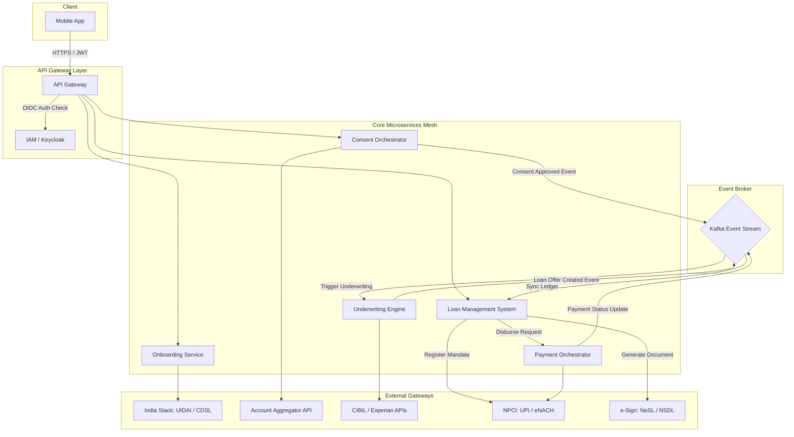

# TOGAF Phase C: Application Architecture

This document defines the **Application Architecture** for the mobile micro-loan platform. It details the application portfolio, microservices interaction blueprints, API configurations, and Application Architecture Building Blocks (AABBs).

---

## 1. Application Portfolio Catalog

The platform is designed as a cloud-native microservices mesh. All internal communication is mediated via a service mesh, while external traffic enters via a secure API Gateway.

| Microservice Name | Language/Tech | Logical Role | Data Store Dependency |
| :--- | :--- | :--- | :--- |
| **Mobile Client App** | React Native | Client interface, biometric verification, local caching. | SQLite (Encrypted) |
| **API Gateway** | Kong / Apigee | Rate limiting, SSL termination, routing, JWT validation. | Redis (Session cache) |
| **Onboarding Service** | Go | Interfaces with UIDAI, PAN database, and DigiLocker. | PostgreSQL (Temp Stage) |
| **Consent Orchestrator** | Node.js | Generates and monitors Account Aggregator requests. | PostgreSQL (Consent DB) |
| **Underwriting Engine** | Python (FastAPI)| Executes decision trees, ML scorecards, and fraud checks. | Redis (Model Cache) |
| **Loan Management (LMS)**| Java (Spring Boot)| Double-entry ledger, accrual calculation, billing. | PostgreSQL (Core Ledger) |
| **Payment Orchestrator** | Go | Direct interface with NPCI and bank host-to-host APIs. | PostgreSQL (Payments) |
| **Notification Engine** | Node.js | Asynchronous WhatsApp, SMS, and Push notifications. | Kafka Queue |

---

## 2. Microservices Interaction Blueprint



---

## 3. Core API Specifications (JSON Payload Design)

### 3.1 Credit Assessment Ingestion API
Used by the Consent Orchestrator to notify the Underwriting Engine that transaction data has been gathered.

* **Endpoint**: `POST /api/v1/underwrite/assess`
* **Security**: Mutual TLS (mTLS) + API Token
* **Payload Structure**:
```json
{
  "application_id": "8f3b6c2d-9e1a-4f5c-8b7d-6e5a4d3c2b1a",
  "customer_id": "1a2b3c4d-5e6f-7a8b-9c0d-1e2f3a4b5c6d",
  "consent_handle": "AA-CONSENT-99882233",
  "account_aggregator_id": "user@aa-provider",
  "bureau_data": {
    "cibil_score": 720,
    "active_loans_count": 2,
    "total_outstanding_amount": 150000.00,
    "delayed_payments_30_days": 0
  },
  "analyzed_bank_metrics": {
    "average_monthly_balance": 45000.00,
    "salary_estimate": 65000.00,
    "cheque_bounce_6m": 0,
    "mandate_failure_6m": 0
  }
}
```

---

## 4. Integration Patterns & Resiliency

To guarantee **zero human intervention**, the application architecture implements resilient design patterns:

1. **Circuit Breaker Pattern (Resilience)**: External network calls (e.g., to Credit Bureau or e-Sign portal) are wrapped in Circuit Breakers (using Resilience4j/Envoy). If a provider fails (high error rates or timeouts), the system fails fast and routes traffic to a backup provider (e.g., CIBIL fallback to Experian) or alerts the customer to try again in a few minutes.
2. **Transactional Outbox Pattern**: To ensure database states (LMS ledger) and Kafka messages (triggering payment disbursals) are in sync, microservices write events to a local outbox database table in the same transaction, which are then published to Kafka.
3. **Idempotent Payment Handlers**: The Payment Orchestrator generates a unique idempotent key (`idempotency_key = application_id + status_stage`) for every IMPS/UPI request sent to the sponsor bank. If network failure occurs, retries will not cause double-disbursal.
4. **CBS Reconciliation & Accounting Co-existence**: 
   - *Decoupled Ledger*: To protect the core banking ledger from mobile scale spikes, the Digital Ledger (LMS) acts as the sub-ledger (OLTP).
   - *Asynchronous Accounting Sync*: At the end of each day (EOD), the LMS publishes aggregated ledger postings (grouped by GL codes for principal, interest, processing fees, GST) to Kafka.
   - *Saga Orchestrator*: An accounting connector consumes these events and updates the legacy CBS General Ledger (GL) accounts.
   - *Automated Reconciliation (Rec Engine)*: A daily batch job compares payment gateway bank statements (from Sponsor Bank) with LMS transactions. Mismatches (e.g., failed payouts, duplicate repayments) are auto-logged, quarantined, and flagged to the Finance Ops team for automated retry or reversal.


---

## 5. Application Architecture Building Blocks (AABBs)

### 5.1 API Gateway AABB
* **ID**: AABB-GW-01
* **Description**: Logical block acting as the entry point for all client requests, offering token validation, dynamic routing, SSL termination, and rate-limiting.
* **SBB Candidate**: Kong Gateway Enterprise.

### 5.2 India Stack Orchestrator AABB
* **ID**: AABB-ISO-01
* **Description**: Orchestrates multi-party handshakes with external Gov-Tech systems (UIDAI, CDSL, DigiLocker, NeSL) while normalizing request/response models.
* **SBB Candidate**: Custom Go microservice.

### 5.3 Asynchronous Event Broker AABB
* **ID**: AABB-EVB-01
* **Description**: Central event broker that guarantees message delivery and ordered processing of loan lifecycle events (onboarding, approval, disbursal).
* **SBB Candidate**: Apache Kafka.

### 5.4 Loan Calculation & Accrual Engine AABB
* **ID**: AABB-LCE-01
* **Description**: Highly precise financial calculation engine that manages amortization schedules, interest accruals, processing fee splits, and penalty calculations.
* **SBB Candidate**: Custom Java microservice using BigDecimal.
