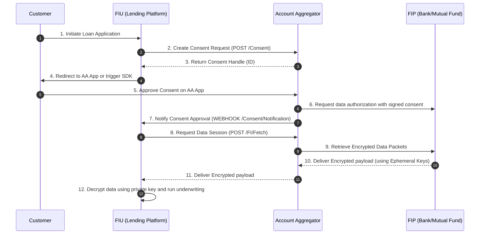

# Phase C: Data Architecture - DEPA Consent Architecture

This document describes the design of the Data Empowerment and Protection Architecture (DEPA) integration for secure, consent-led financial data aggregation using the India Stack Account Aggregator (AA) framework.

---

## 1. Consent Flow Architecture

The data retrieval workflow consists of three primary roles:
1. **Financial Information Provider (FIP):** Institutions holding customer financial data (e.g., Banks, Mutual Funds).
2. **Financial Information User (FIU):** The digital lending platform requesting data to perform underwriting.
3. **Account Aggregator (AA):** The consent manager facilitating interaction between the customer, FIPs, and the FIU.

### Sequence Workflow Diagram



---

## 2. ReBIT-Compliant Consent Artifact Schema

The consent artifact is a cryptographically signed JSON structure representing the contract between the customer, the FIU, and the FIP. It follows the standard Schema defined by **ReBIT (Reserve Bank Information Technology)**.

### Consent Request Artifact Structure (JSON)
```json
{
  "ver": "1.0.0",
  "timestamp": "2026-05-21T17:15:30Z",
  "txnid": "60e1dcb3-4882-411a-8bb4-df9195baee0c",
  "ConsentDetail": {
    "consentStart": "2026-05-21T17:15:30Z",
    "consentExpiry": "2026-06-21T17:15:30Z",
    "consentMode": "STORED",
    "fetchMode": "PERIODIC",
    "consentTypes": ["PROFILE", "SUMMARY", "TRANSACTIONS"],
    "fiTypes": ["DEPOSIT", "TERM_DEPOSIT"],
    "DataConsumer": {
      "id": "FIU-Lending-Corp-01"
    },
    "Customer": {
      "id": "customer@9999999999@xyz-aa"
    },
    "Purpose": {
      "code": "101",
      "refUri": "https://api.fiu-lender.com/purposes/101",
      "text": "Credit Underwriting for Personal Loan Application",
      "Category": {
        "type": "PersonalLoan"
      }
    },
    "FIDataRange": {
      "from": "2025-11-01T00:00:00Z",
      "to": "2026-05-01T00:00:00Z"
    },
    "DataLife": {
      "unit": "MONTH",
      "value": 24
    },
    "Frequency": {
      "unit": "HOUR",
      "value": 12
    },
    "DataFilter": [
      {
        "type": "TRANSACTION_AMOUNT",
        "operator": ">=",
        "value": "0.00"
      }
    ]
  },
  "Signature": "MEQCIFq9dG...[Digital Signature of AA verifying Consent Approval]"
}
```

---

## 3. Session Key Exchange (ECDH) & Security Specs

To maintain strict data privacy, data is encrypted end-to-end between the FIP and the FIU. Neither the Account Aggregator nor any third party can read the contents of the payload.

### Cryptographic Stack Requirements
* **Asymmetric Algorithm:** ECDH (Elliptic Curve Diffie-Hellman)
* **Curve:** Curve25519 (or secp256r1 as per ReBIT mandates)
* **Symmetric Encryption:** AES-GCM-256 (Galois/Counter Mode) with an initialization vector (IV) and authentication tag.
* **Key Derivation Function:** HKDF (HMAC-based Extract-and-Expand Key Derivation Function using SHA-256).

### Sequence of Key Exchange and Decryption

1. **Key Generation by FIU:**
   For every financial data fetch request, the FIU generates a fresh ephemeral Elliptic Curve key pair:
   $$\text{Private Key: } d_{FIU}, \quad \text{Public Key: } Q_{FIU} = d_{FIU} \times G$$

2. **Sharing of Public Parameters:**
   The FIU shares $Q_{FIU}$ and a random nonce ($Nonce_{FIU}$) inside the `/FI/Fetch` request to the AA, which forwards it to the FIP.

3. **Key Generation & Shared Secret Calculation by FIP:**
   The FIP generates its own ephemeral key pair ($d_{FIP}, Q_{FIP}$) and calculates the shared secret ($S$):
   $$S = d_{FIP} \times Q_{FIU} = d_{FIP} \times d_{FIU} \times G$$
   The FIP derives the symmetric key ($K_{session}$) using HKDF:
   $$K_{session} = \text{HKDF}(S, Nonce_{FIU} \parallel Nonce_{FIP})$$

4. **Payload Encryption by FIP:**
   The FIP encrypts the financial data payload (e.g. bank statement XML/JSON) using AES-GCM-256 with $K_{session}$ and generates a 12-byte IV and 16-byte authentication tag:
   $$\text{Ciphertext, Tag} = \text{AES-GCM-256}(K_{session}, \text{Plaintext Data}, \text{IV})$$

5. **Payload Delivery:**
   The FIP packages and sends the `Ciphertext`, `Tag`, `IV`, its public key $Q_{FIP}$, and $Nonce_{FIP}$ back to the AA, which relays it to the FIU.

6. **Decryption by FIU:**
   Upon receipt, the FIU calculates the identical shared secret ($S$):
   $$S = d_{FIU} \times Q_{FIP} = d_{FIU} \times d_{FIP} \times G$$
   FIU derives $K_{session}$ using the same HKDF configuration and decrypts the payload:
   $$\text{Plaintext Data} = \text{AES-GCM-256-Decrypt}(K_{session}, \text{Ciphertext}, \text{Tag}, \text{IV})$$

### Session Parameters Schema (JSON Payload during FI Fetch response)
```json
{
  "fipId": "HDFC-FIP-01",
  "data": [
    {
      "encryptedFI": "eyJh...[Base64 Encrypted String]",
      "key": {
        "kty": "EC",
        "crv": "Curve25519",
        "x": "x_FIP_Ephemeral_Public_Key_Base64URL",
        "y": "y_FIP_Ephemeral_Public_Key_Base64URL"
      },
      "nonce": "FIP_Generated_Nonce_Base64",
      "dhPublicKey": {
        "kty": "EC",
        "crv": "Curve25519",
        "x": "FIU_Generated_Public_Key_Base64URL",
        "y": "FIU_Generated_Public_Key_Base64URL"
      }
    }
  ]
}
```
