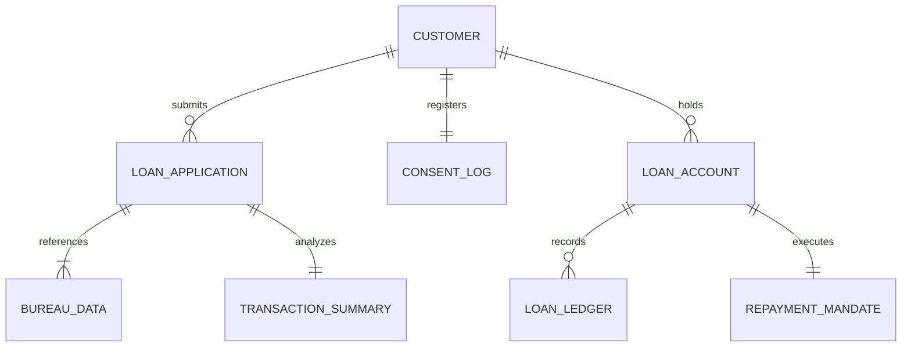
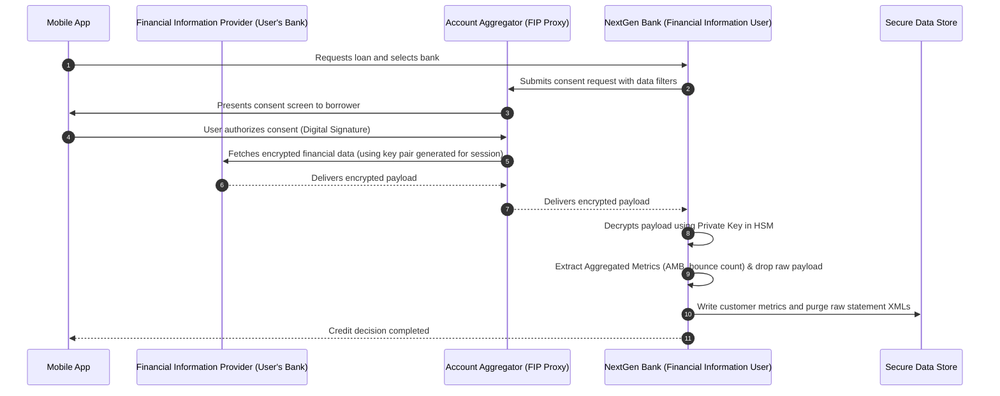

# TOGAF Phase C: Data Architecture

This document defines the **Data Architecture** for the mobile micro-loan platform. It details the logical data entities, data classification levels, consent framework, and Data Architecture Building Blocks (DABBs).

---

## 1. Logical Data Model

The logical schema is normalized to ensure transactional consistency in loan ledgers, while analytical domains (scoring) consume read-only replicated views.

### 1.1 Data Entity Definitions

#### CUSTOMER (PII - Restricted)
Stores identity and verified credentials from e-KYC.
* `customer_id` (UUID, Primary Key)
* `full_name` (String, encrypted)
* `dob` (Date, encrypted)
* `gender` (Enum, encrypted)
* `aadhaar_masked` (String, encrypted, last 4 digits)
* `pan_hash` (String, hashed using SHA-256 with salt)
* `registered_mobile` (String, encrypted)
* `email_address` (String, encrypted)
* `current_address` (JSON, encrypted)

#### LOAN_APPLICATION (Confidential)
Tracks a borrower's application lifecycle.
* `application_id` (UUID, Primary Key)
* `customer_id` (UUID, Foreign Key)
* `applied_amount` (Decimal)
* `tenure_months` (Integer)
* `application_status` (Enum: INITIATED, KYC_COMPLETED, UNDERWRITTEN, OFFERED, SIGNED, DISBURSED, REJECTED)
* `applied_timestamp` (Timestamp)
* `rejection_reason` (String, null if approved)

#### CONSENT_LOG (Immutable / Audit Trail)
Maintains audit proof of customer consent under the DPDP Act.
* `consent_id` (UUID, Primary Key)
* `customer_id` (UUID, Foreign Key)
* `consent_artifact` (JSON: containing digital signature of customer, scope of data, validity, purpose)
* `granted_at` (Timestamp)
* `expires_at` (Timestamp)
* `revoked_at` (Timestamp, null if active)
* `ip_address` (String)

#### LOAN_ACCOUNT (Confidential)
Represents the active loan facility.
* `loan_account_number` (String, Primary Key)
* `application_id` (UUID, Foreign Key)
* `customer_id` (UUID, Foreign Key)
* `sanctioned_amount` (Decimal)
* `interest_rate_annual` (Decimal)
* `outstanding_principal` (Decimal)
* `outstanding_interest` (Decimal)
* `loan_status` (Enum: ACTIVE, DELINQUENT, CLOSED, WRITTEN_OFF)
* `disbursal_date` (Date)

#### LOAN_LEDGER (Confidential)
Double-entry transactional ledger tracking fund movements.
* `transaction_id` (UUID, Primary Key)
* `loan_account_number` (String, Foreign Key)
* `transaction_type` (Enum: DISBURSAL, REPAYMENT_PRINCIPAL, REPAYMENT_INTEREST, LATE_FEE, WAIVER)
* `amount` (Decimal)
* `value_date` (Date)
* `payment_reference_id` (String)
* `ledger_balance` (Decimal)

---

## 2. Data Classification & Security Matrix

To protect financial data and personal identities, access is strictly governed.

| Data Domain | Sensitive Columns | Classification | Storage Encryption | Transmission Encryption | Masking / Tokenization |
| :--- | :--- | :--- | :--- | :--- | :--- |
| **Identity (KYC)** | Name, Address, Photo, DOB, Phone | **Restricted (PII)** | AES-256-GCM (Enveloped via KMS) | TLS 1.3 + mTLS (Partner APIs) | Masked in Logs & internal dashboard UI |
| **Financial Health** | Bank Statement, Salary, Credit Bureau Score | **Confidential** | AES-256 | TLS 1.3 | Tokenized ID generated for analytics models |
| **Loan Status** | Outstanding balance, EMI dates, delay history | **Confidential** | AES-256 | TLS 1.2+ | None |
| **Audit Logs** | IP address, login times, API telemetry | **Internal** | Standard Block Encryption | TLS 1.2+ | Phone/ID hashed |

---

## 3. Data Flow & Integration Architecture (Consent Flow)

Data ingestion relies strictly on the **DEPA (Data Empowerment and Protection Architecture)**. Raw bank statements are never stored directly; they are ingested, parsed into transactional metadata, and the raw statements are purged.

---

## 4. Data Retention & Purge Policy (DPDP Act Compliance)

1. **Rejected Applications**: All ingested data (Bureau logs, Account Aggregator statements, device telemetry) must be completely purged from the primary transactional database within **30 days** of rejection. Only `application_id`, `pan_hash` (for duplicate checks), and the immutable `consent_log` are retained for regulatory audit.
2. **Active Loans**: Transaction data and customer PII are retained throughout the loan lifecycle.
3. **Closed Loans**: In compliance with banking regulations, KYC and transaction logs are archived in a secure offline storage for **7 years** post-loan closure, after which they are permanently shredded.

---

## 5. Data Architecture Building Blocks (DABBs)

DABBs define logical data-handling capabilities.

### 5.1 Enveloped Encryption DABB
* **ID**: DABB-SEC-01
* **Description**: Logical capability to encrypt cell-level data using local Data Encryption Keys (DEKs) wrapped by a central Key Encryption Key (KEK) managed in an HSM.
* **Requirements**: Zero plaintext PII must exist in database memory dumps or logs.

### 5.2 Consent Audit Log DABB
* **ID**: DABB-AUD-01
* **Description**: Cryptographically chained ledger logging all customer consent actions (grants, usage, revocations).
* **Requirements**: Log entries must be tamper-evident (e.g., using SHA-256 block chains) and read-only.

### 5.3 Automated Purge DABB
* **ID**: DABB-PRG-01
* **Description**: Cron-driven database routine that identifies expired accounts/rejected files and securely deletes associated raw data, overwriting memory storage sectors.
