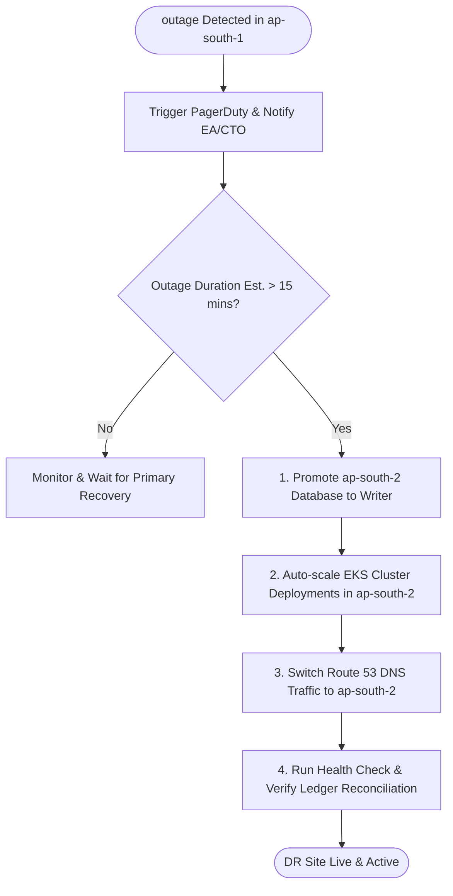

# Technology Architecture: Disaster Recovery & Business Continuity Plan

This document establishes the **Disaster Recovery (DR)** and **Business Continuity Plan (BCP)** for NextGen Bank's **Straight-Through Processing (STP) Micro-Loan Mobile Platform**, ensuring high availability and compliance with banking regulations (RBI guidelines).

---

## 1. DR Targets (RTO & RPO)

The platform must satisfy the following recovery targets:

*   **Recovery Time Objective (RTO)**: **< 30 minutes** (Maximum allowable downtime for core loan servicing and disbursals).
*   **Recovery Point Objective (RPO)**: **< 10 seconds** (Maximum allowable data loss window for transactional lending ledgers).

---

## 2. Multi-Region Deployment Architecture

To achieve the RTO/RPO targets, the platform is deployed in a **Hot-Standby (Active-Passive)** configuration across two AWS Regions:
*   **Primary Region**: `ap-south-1` (Mumbai)
*   **DR Region**: `ap-south-2` (Hyderabad)

```
                       ┌─────────────────────────┐
                       │ AWS Route 53 (DNS Gate) │
                       └────────────┬────────────┘
                                    │
                  ┌─────────────────┴─────────────────┐
       Primary: ap-south-1                  Passive DR: ap-south-2
       (Active Region)                      (Hot Standby)
       ┌─────────────────────┐              ┌─────────────────────┐
       │ Kong API Gateway    │              │ Kong API Gateway    │
       └──────────┬──────────┘              └──────────┬──────────┘
                  │                                    │
       ┌──────────▼──────────┐              ┌──────────▼──────────┐
       │ EKS Cluster (Live)  │              │ EKS Cluster (Idle)  │
       └──────────┬──────────┘              └──────────┬──────────┘
                  │                                    │
       ┌──────────▼──────────┐  Aurora Cross-  ┌──────────▼──────────┐
       │ Aurora PostgreSQL   │  Region Async   │ Aurora PostgreSQL   │
       │ (Primary Writer)    │ ──────────────> │ (Replica / Reader)  │
       └─────────────────────┘   Replica Lag   └─────────────────────┘
                                   (< 1s)
```

### 2.1 Database Replication (Aurora Global Database)
*   **Replication Method**: AWS Aurora Global Database utilizing storage-level physical replication.
*   **Performance**: Cross-region replication lag is typically `< 1 second`, keeping the RPO well below the 10-second target.
*   **Failover**: In the event of primary region failure, the Aurora Hyderabad cluster is promoted to writer mode, requiring zero data restore steps.

### 2.2 Cryptographic Key Replication (AWS KMS)
*   **Multi-Region Keys**: Cloud KMS keys used for encrypting PII data stores and signing loan agreements are provisioned as AWS Multi-Region replica keys.
*   **Compliance**: Keys share the same key ID and key material across Mumbai and Hyderabad, allowing the DR region to decrypt and process data instantly without key synchronization delays.

---

## 3. Failover Execution Workflow

In the event of a catastrophic outage in the Mumbai region:



---

## 4. Backup & Backup Retention Policy

*   **Ledger Backups**: Continuous daily snapshots backed up to isolated, immutable S3 buckets using AWS Backup Vault Lock (preventing deletion or encryption by ransomware).
*   **Retention Period**: Ledger database snapshots are retained for **7 years** to satisfy financial auditing and regulatory requirements.
*   **Testing**: Automated recovery drills are executed quarterly, restoring the production database backup into an isolated staging VPC to verify data integrity.
