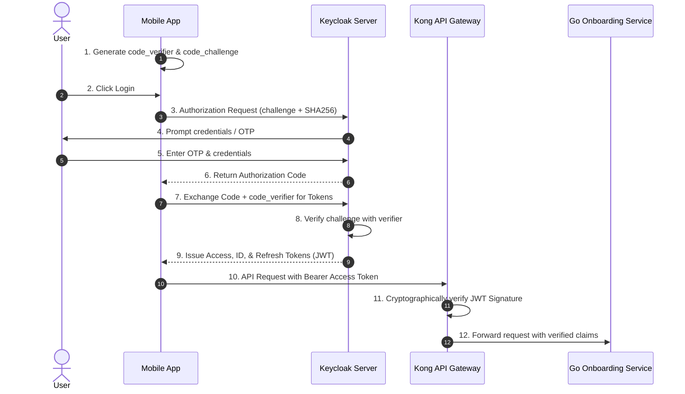

# Phase D: Technology Architecture - Security Architecture

This document specifies the security controls, identity workflows, cryptographic key management policies, and mesh security protocols protecting the digital lending platform.

---

## 1. Cryptographic Key Management (CloudHSM & KMS)

The platform enforces a dual key management strategy separating highly regulated regulatory payloads (such as Aadhaar numbers) from standard application data.

```
                  ┌──────────────────────────────┐
                  │          AWS KMS             │
                  │  (Envelope Encryption Keys)  │
                  └──────────────┬───────────────┘
                                 │
                 ┌───────────────┴───────────────┐
                 ▼                               ▼
       ┌──────────────────┐            ┌──────────────────┐
       │   App Database   │            │    S3 Storage    │
       │ (Customer/Ledger)│            │   (Bank Stmts)   │
       └──────────────────┘            └──────────────────┘

                  ┌──────────────────────────────┐
                  │         AWS CloudHSM         │
                  │  (FIPS 140-2 L3 Hardware)   │
                  └──────────────┬───────────────┘
                                 │ (AES Key Wrap RFC 3394)
                 ┌───────────────┴───────────────┐
                 ▼                               ▼
       ┌──────────────────┐            ┌──────────────────┐
       │  Aadhaar Vault   │            │   FIP Data Keys  │
       │  Master Wrapping │            │ (AA Decryption)  │
       └──────────────────┘            └──────────────────┘
```

### AWS CloudHSM Key Wrap Specifications
* **Use Case:** Tokenization and encryption of raw Aadhaar data in compliance with UIDAI regulations.
* **Hardware Specs:** Dedicated FIPS 140-2 Level 3 Hardware Security Module (HSM).
* **Key Wrap Algorithm:** AES-KeyWrap (RFC 3394) with 256-bit Key Encrypting Keys (KEKs).
* **Operation Flow:**
  1. The Onboarding service requests a wrap key from CloudHSM.
  2. CloudHSM wraps the local ephemeral data key using the HSM-generated KEK.
  3. The wrapped data key is stored alongside the encrypted payload in the Aadhaar database, meaning raw keys are never stored in memory or disk outside the HSM boundary.

### AWS KMS Configurations
Application data keys (for RDS and S3) are managed using AWS KMS with the following properties:
* **Key Type:** Symmetric KMS key, `SYMMETRIC_DEFAULT` (AES-256-GCM).
* **Rotation Policy:** Automatic annual key rotation enabled.
* **IAM Key Policy Example (Strict Least Privilege):**
```json
{
  "Version": "2012-10-17",
  "Statement": [
    {
      "Sid": "Allow EKS App Role to Encrypt/Decrypt",
      "Effect": "Allow",
      "Principal": {
        "AWS": "arn:aws:iam::123456789012:role/eks-onboarding-pod-role"
      },
      "Action": [
        "kms:Encrypt",
        "kms:Decrypt",
        "kms:ReEncrypt*",
        "kms:GenerateDataKey*",
        "kms:DescribeKey"
      ],
      "Resource": "*"
    }
  ]
}
```

---

## 2. Keycloak OIDC/OAuth2 Authentication Flow

All client requests from Mobile apps and Admin portals verify identity via a central Keycloak deployment.

### Mobile App Authentication (OAuth2 + PKCE)
Since mobile apps are public clients and cannot safely store a client secret, they must use the **Authorization Code Flow with PKCE (Proof Key for Code Exchange)**.



### JWT Claims Configuration
Tokens contain standard OAuth claims as well as customized RBAC (Role-Based Access Control) scopes:
```json
{
  "sub": "auth0|9938d281-2283-4e4f-b1e7-63a1e2f4a471",
  "iss": "https://auth.lender.com/realms/digital-lending",
  "aud": "api-gateway",
  "exp": 1779435600,
  "resource_access": {
    "lending-app": {
      "roles": ["underwriter", "disbursement-approver"]
    }
  },
  "preferred_username": "underwriting_agent_05"
}
```

---

## 3. Istio mTLS Service Mesh Architecture

To secure East-West traffic inside the Kubernetes cluster, we deploy an **Istio Service Mesh** configured with **STRICT mTLS**.

### mTLS Enforcement Policy
This policy forces all communications within the `private-app` namespace to use encrypted mTLS. Any plaintext request is rejected immediately at the Envoy sidecar level.

```yaml
apiVersion: security.istio.io/v1beta1
kind: PeerAuthentication
metadata:
  name: default
  namespace: private-app
spec:
  mtls:
    mode: STRICT
```

### Certificate Issuance and Rotation
* **Certificate Authority (CA):** Istio CA (Citadel) manages internal service certificates.
* **Rotation Schedule:** Service certificates are automatically rotated every 24 hours by Envoy sidecars.
* **Authentication Verification:** The Envoy sidecar verifies peer certificates using SAN (Subject Alternative Name) verification, matching the SPIFFE ID format (e.g., `spiffe://cluster.local/ns/private-app/sa/onboarding-service-sa`).
