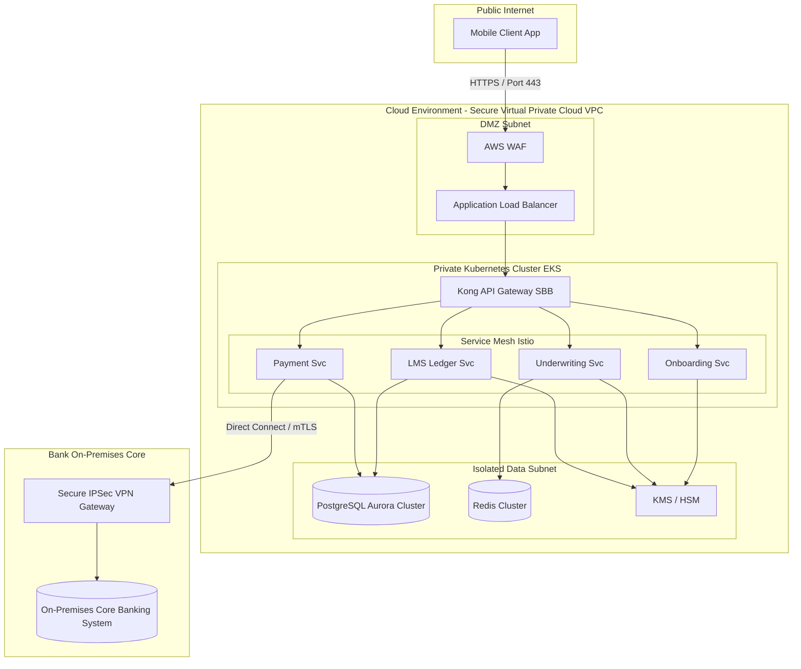

# TOGAF Phase D: Technology Architecture

This document defines the **Technology Architecture** for NextGen Bank's mobile micro-loan platform. It details physical deployment models, networking configurations, database clusters, security models, and Technology Architecture Building Blocks (TABBs).

---

## 1. Cloud-Native Infrastructure & Network Topology

The architecture leverages a hybrid-cloud design. The customer-facing microservices are hosted in a secure, local public cloud region (e.g., AWS Mumbai / Azure Central India) to comply with data residency regulations, while core financial settlements are synced back to the bank’s on-premises Core Banking Systems via a dedicated leased line (Direct Connect / ExpressRoute).

### 1.1 Network Security Zones
1. **Zone 1: DMZ (Public Zone)**: Contains Web Application Firewall (WAF) and Load Balancers. No direct database access or business logic exists in this zone.
2. **Zone 2: Application Private Subnet (Restricted)**: Hosts the Kubernetes cluster. All node communication is limited to internal VPC IP ranges. All microservices communicate with each other using **mTLS (Mutual TLS)** enforced by Istio service mesh.
3. **Zone 3: Database Private Subnet (Highly Restricted)**: Hosts database clusters and Redis caches. Accessible only from Zone 2 IP addresses on specific database ports (e.g., port 5432 for PostgreSQL).
4. **Zone 4: Security Core**: Dedicated region for Cloud HSM (Hardware Security Module) and Key Management Service (KMS), accessible only via audited IAM roles.

---

## 2. Core Databases & Storage Technologies

* **Transactional Database (OLTP)**: **AWS Aurora PostgreSQL** (Multi-AZ with auto-failover). Configured with synchronous replication within the region. Read replicas are used for high-throughput query offloading.
* **In-Memory Caching & Session Store**: **Redis Enterprise Cluster** with active-active replication to maintain token states and temporary credit scorecards.
* **Event Broker**: **Managed Apache Kafka** (MSK) distributed across three Availability Zones to prevent message loss.
* **Audit Logs Store**: **Write-Once-Read-Many (WORM)** cloud storage buckets (e.g., S3 with Object Lock enabled) to store immutable consent logs and transaction receipts.

---

## 3. DevSecOps & Deployment Strategy

* **Containerization & Orchestration**: Kubernetes (EKS/AKS). Microservices are packaged as Docker images.
* **Deployment Model**: GitOps using **ArgoCD**. Developers commit code changes, triggering automated builds. Upon successful verification, Kubernetes manifests are updated, and ArgoCD syncs the cluster.
* **Security Pipeline Checks (CI/CD)**:
  - **SAST (Static Application Security Testing)**: SonarQube / Snyk scanner integrated into GitHub Actions.
  - **Container Scanning**: Trivy scanner checks base images for CVEs.
  - **Secrets Detection**: GitGuardian prevents hardcoded credentials or API keys from being committed.
* **Observability & Monitoring**: Prometheus for metrics collection, Grafana for visualization dashboards, and Jaeger for distributed tracing of APIs.

---

## 4. Disaster Recovery (DR) & High Availability (HA)

To meet the RBI guidelines for financial infrastructure, the technology architecture guarantees:
* **High Availability**: Multi-AZ deployments with automatic load balancing and active-active replicas for databases.
* **Disaster Recovery Strategy**: Active-Passive setup across two Indian regions (e.g., Primary: Mumbai, DR: Pune).
* **RPO (Recovery Point Objective)**: < 1 minute (databases sync continuously).
* **RTO (Recovery Time Objective)**: < 15 minutes (automated DNS switchover via Route53).

---

## 5. Fraud Defense Framework (Zero-Trust Identity)

Because the mobile application executes with zero human intervention, the system is exposed to high-frequency automated fraud attacks. The Technology Architecture deploys a multi-layered fraud defense shield:

1. **Device Binding & Fingerprinting**:
   - The Mobile App SDK generates a unique cryptographic device hash using hardware identifiers (e.g., Secure Enclave key pairs, CPU IDs, and MAC addresses).
   - This device fingerprint is verified during every login/API request. Emulator or simulator sessions are blocked instantly.
   - Restrict application submissions to a maximum of 1 active device per PAN/Aadhaar profile.
2. **Dynamic Liveness & Deepfake Prevention**:
   - The KYC Onboarding service integrates a 3D active liveness video streaming component.
   - Face matching checks the incoming frame stream against the Aadhaar photo, verifying eye blinking, head rotation, and depth mapping to prevent photo/screen display bypasses.
3. **Velocity Limits & IP Geofencing**:
   - The API Gateway maintains sliding-window rate-limiting keys in Redis: max 3 login attempts per device per 10 minutes; max 1 loan application request per 24 hours.
   - System denies API requests originating outside India’s geographical boundaries (using MaxMind IP Geo-databases updated daily).
4. **Mule Account Risk Scoring**:
   - The Underwriting Engine routes the destination bank account (for disbursal) to verification databases to check if the target IFSC and account number are listed in national mule databases or have high historical velocity flags.

---

## 6. Technology Architecture Building Blocks (TABBs)

### 5.1 Kubernetes Cluster TABB
* **ID**: TABB-K8S-01
* **Description**: Secure, managed container runtime cluster capable of auto-scaling based on CPU/Memory load.
* **SBB Candidate**: AWS Elastic Kubernetes Service (EKS) / Azure Kubernetes Service (AKS).

### 5.2 Key Management Service & HSM TABB
* **ID**: TABB-SEC-02
* **Description**: Hardware-backed cryptographic system for managing encryption keys, generating digital signatures, and securing database master passwords.
* **SBB Candidate**: HashiCorp Vault + AWS CloudHSM.

### 5.3 High-Performance PostgreSQL Cluster TABB
* **ID**: TABB-DB-01
* **Description**: Distributed relational database capable of executing ACID-compliant banking transactions with automatic failover and point-in-time recovery.
* **SBB Candidate**: AWS Aurora Serverless v2 (PostgreSQL compatible).

### 5.4 Service Mesh Control Plane TABB
* **ID**: TABB-MSH-01
* **Description**: Enforces mTLS encryption, service authorization policies, and traffic routing rules between internal microservices.
* **SBB Candidate**: Istio Service Mesh.
