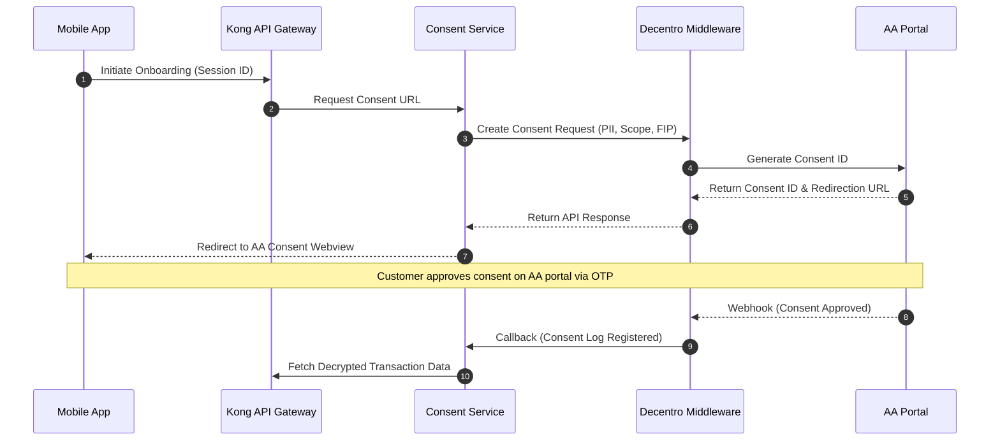

# TOGAF Phase E & F: Gap Analysis & Solutions

This document presents the detailed Gap Analysis and Vendor Evaluation Matrix for NextGen Bank's **Straight-Through Processing (STP) Micro-Loan Mobile Platform**. It builds on the high-level gap analysis introduced in [phase_e_f_migration_roadmap.md](file:///Users/manavshrivastava/Documents/github/untitled%20folder/togaf/architecture_repository/3_architecture_landscape/segment/digital_lending_stp/phase_e_f_migration_roadmap.md) and details the technical solutions and vendor evaluation criteria for the critical components.

---

## 1. Granular Baseline-to-Target Gap Analysis

The migration from NextGen Bank's legacy branch-based lending systems to the STP cloud-native platform requires resolving deep functional, technical, and structural gaps.

### 1.1 Business Architecture Gaps

| Gap ID | Business Capability | Baseline State | Target State | Gap Description | Technical Solution / Action |
| :--- | :--- | :--- | :--- | :--- | :--- |
| **B-GAP-01** | **Underwriting & Decisioning** | Manual physical verification, paper bank statements, Credit Committee review (3-5 days). | Real-time automated underwriting and scoring engine (< 2 seconds execution). | No automated risk rules, scorecards, or real-time risk decisioning capabilities. | Build an in-house Python-based Credit Decision Engine using a dynamic rules repository. |
| **B-GAP-02** | **Onboarding & Verification** | KYC performed via physical branches or manual agent visits with paper photocopies. | 100% digital self-onboarding via Aadhaar e-KYC and passive liveness check. | Absence of digital verification channels, automated facial matching, and liveness detection. | Integrate UIDAI e-KYC API, CDSL PAN verification, and third-party biometric liveness SDK. |
| **B-GAP-03** | **Disbursal & Collection** | Manual batch upload to Core Banking System (CBS) via file transfer (EOD). | Instant disbursal via IMPS/UPI and auto-collection via UPI AutoPay. | CBS is incapable of real-time point-to-point API disbursals and auto-debit triggers. | Integrate a real-time Payment Hub middleware and NPCI UPI AutoPay subscription APIs. |
| **B-GAP-04** | **Customer Support** | Physical branch query resolution or telephone support desk. | In-app self-service, real-time status tracking, and Single-tap GRO access. | No single-tap grievance or regulatory-mandated dispute resolution mechanism in client interface. | Implement dedicated RBI-compliant Grievance Redressal screen with ticketing backend. |

### 1.2 Data Architecture Gaps

| Gap ID | Data Entity / System | Baseline State | Target State | Gap Description | Technical Solution / Action |
| :--- | :--- | :--- | :--- | :--- | :--- |
| **D-GAP-01** | **Customer Income & Transaction Data** | Unstructured PDF bank statements uploaded or photocopied; manual spreadsheet parsing. | Structured JSON bank transaction data fetched via Account Aggregator (AA). | Lack of secure bank parser, standardized data schema, and AA transaction ingestion gateway. | Integrate AA Gateway middleware (e.g., Decentro/Perfios) and implement standardized JSON transaction schemas. |
| **D-GAP-02** | **Consent Audit Trail** | Consent signed physically on paper application form; stored in paper archives. | Cryptographically signed, granular, revocable consent log (DPDP-compliant). | Absence of digital consent manager, consent versioning, and immutable audit logs. | Implement a dedicated microservice Consent Registry storing SHA-256 hashes of consents in an immutable database. |
| **D-GAP-03** | **Customer PII & Erasure** | Customer data permanently stored in core databases; no automated purge processes. | Tokenized, encrypted PII with automated purge pipelines post-loan closure. | Inability to selectively delete/purge customer PII to satisfy the DPDP "Right to Erasure". | Implement database columns encryption (AES-256 via KMS keys) and establish automated data deletion scripts triggered upon loan closure. |

### 1.3 Application Architecture Gaps

| Gap ID | Application Component | Baseline State | Target State | Gap Description | Technical Solution / Action |
| :--- | :--- | :--- | :--- | :--- | :--- |
| **A-GAP-01** | **Loan Ledger Management** | Core Banking System (CBS) running on legacy mainframes (batch processing). | Isolated Cloud-Native Digital Lending Ledger (LMS) with EOD batch sync to CBS. | CBS cannot handle high-throughput micro-transactions (100k+ API calls/day). | Deploy Apache Fineract as an isolated LMS database instance, wrapped in a REST API layer. |
| **A-GAP-02** | **Integration Gateway** | Point-to-point SOAP web services with custom VPN setups for third parties. | Centralized API Gateway (Kong) managing rate limiting, authentication, and routing. | Lack of API gateway, client SDKs, security enforcement layer, and standard OpenAPI specs. | Deploy Kong API Gateway; define all interface contracts using OpenAPI Specification 3.0. |
| **A-GAP-03** | **Notification & Signing** | Physical signature on paper loan agreements. | Digital signature via Aadhaar e-Sign (NSDL/NeSL) with automated email/SMS alerts. | Lack of legal-grade digital signing integrations and automated agreement generation. | Integrate NSDL/NeSL e-Sign gateway API and deploy dynamic HTML-to-PDF agreement renderer. |

### 1.4 Technology Architecture Gaps

| Gap ID | Technology Component | Baseline State | Target State | Gap Description | Technical Solution / Action |
| :--- | :--- | :--- | :--- | :--- | :--- |
| **T-GAP-01** | **Infrastructure & Hosting** | On-premises physical servers running VMware ESXi; manual provisioning. | Containerized Kubernetes clusters (EKS/AKS) with GitOps CI/CD. | Lack of auto-scaling, modern container orchestration, and automated deployment pipelines. | Establish AWS EKS clusters, configure Karpenter for auto-scaling, and set up ArgoCD pipelines. |
| **T-GAP-02** | **Secret Management** | Credentials and API keys stored in plaintext config files on application servers. | Centralized cloud Key Management Service (KMS) and HashiCorp Vault. | Absence of secret rotation, cryptographic key management, and secure envelope encryption. | Implement HashiCorp Vault for database/API credentials; encrypt DB columns using AWS KMS. |
| **T-GAP-03** | **Observability** | Standard log files written to local disk; reviewed manually during outages. | Distributed tracing, centralized logging, and real-time metrics dashboards. | Lack of cross-service tracing (Correlation IDs), performance telemetry, and SLA dashboards. | Integrate OpenTelemetry, Prometheus, and Grafana; implement correlation IDs in all microservice HTTP headers. |

---

## 2. Detailed Vendor Matrix & Evaluation

To implement the target architecture rapidly while minimizing risk, NextGen Bank evaluated leading vendors across three critical middleware domains: **Account Aggregator (AA)**, **Loan Management System (LMS)**, and **Risk Scoring / Underwriting SaaS**.

### 2.1 Account Aggregator (AA) Middleware

The Account Aggregator network enables consent-based financial data sharing. Directly integrating with 15+ individual AAs is commercially and technically unviable. A middleware partner is required.

| Parameter | Option 1: Decentro | Option 2: Perfios (AA Connect) | Option 3: Finvu | Option 4: Setu (Pine Labs) |
| :--- | :--- | :--- | :--- | :--- |
| **FIP Coverage** | **98%** (Direct connectivity to all major PSU and private banks). | **95%** (Comprehensive but occasionally relies on screen-scraping fallbacks). | **85%** (Strong focus on direct AA rails, limited non-AA fallbacks). | **92%** (Fast onboarding of new FIPs, backed by Setu gateway). |
| **Latency (Fetch & Parse)** | **Average: 1.2s - 2.5s** (High performance, pre-parsed JSON payloads). | **Average: 2.0s - 4.5s** (Parser has high overhead due to legacy formats support). | **Average: 1.5s - 3.0s** (Direct fetch, basic parsing required by client). | **Average: 1.1s - 2.2s** (Optimized GraphQL interface, very low overhead). |
| **SDK & UI Customization** | Highly customizable web/mobile SDKs. Seamless white-labeling. | Standard UI template, limited styling adjustments allowed. | Basic SDK, requires significant custom UI development wrapper. | Sleek, modern SDK. High customizability and modern React Native/Flutter templates. |
| **Consent Drop-off Rate** | **Low (~12%)** (Optimized UI redirection and instant OTP autofill). | **Medium (~18%)** (Multi-step verification interface can cause friction). | **Medium (~20%)** (User interface is functional but lacks micro-interactions). | **Low (~14%)** (Highly optimized UX flows, dynamic redirect handling). |
| **Pricing Model** | ₹4.50 per successful consent fetch + ₹1.50 per statement analysis. | ₹6.50 per fetch (includes basic analysis). Volume-based tiers. | ₹3.50 per fetch. Minimum monthly commitment required. | ₹4.00 per fetch. Pay-as-you-go with no commitments. |
| **Integration Complexity** | **Low**: REST APIs, excellent sandbox environment, and Postman collections. | **Medium**: XML-heavy payloads, complex encryption requirements on payload. | **High**: Custom gRPC/REST mix, sparse developer documentation. | **Low**: Modern developer dashboard, instant API key generation. |
| **Selection & Decision** | **Recommended (Option 1 - Decentro)**: Chosen due to the lowest integration latency, pre-parsed JSON output (minimizing client-side processing), and lowest consent drop-off rate, which is critical for a high-converting mobile app. | - | - | **Alternative (Setu)**: Back-up option in case of contract negotiation delays. |

### 2.2 Loan Management System (LMS)

The LMS serves as the system of record for all loans, interest accruals, repayments, and schedules.

| Parameter | Option 1: Finflux | Option 2: Apache Fineract (Self-Hosted) | Option 3: Mambu |
| :--- | :--- | :--- | :--- |
| **Ledger Architecture** | Proprietary double-entry ledger optimized for digital lending. | Standard Apache open-source double-entry ledger. Highly extensible. | Multi-tenant cloud-native double-entry ledger. Highly performant. |
| **API Coverage** | 100% API coverage (RESTful JSON). | 100% API coverage. Highly documented. | RESTful APIs, webhooks support, event-driven streaming. |
| **Scalability** | Evaluated up to 5,000 requests/min. Cloud-hosted SaaS. | Scalable depending on deployment topology (needs customized indexing). | Proven scale of 100,000+ active loans per minute globally. |
| **Customization Costs** | SaaS subscription + implementation fee (Medium cost). | Zero licensing cost. High initial engineering build and support cost. | **Very High**: Expensive annual license fee + per-account transaction cost. |
| **RBI Compliance Support** | Pre-built modules for Indian compliance (NPA 90-day rules, restructuring). | Requires custom configurations/plugins to handle Indian bank NPA rules. | Pre-configured compliance templates, but requires adaptation for RBI rules. |
| **Interest Accrual Types** | Daily reducing, monthly reducing, flat rate, moratorium-aware. | Highly flexible interest calculation engine (daily reducing, moratoriums). | Cloud engine supports all standard global interest calculations. |
| **Selection & Decision** | **Recommended (Option 1 - Finflux)**: Out-of-the-box support for RBI lending standards (NPA rules, cooling-off calculation, moratoriums) combined with 100% API coverage makes it the safest option for rapid compliant launch. | **Hybrid Alternative (Fineract)**: We will use Finflux (which is commercialized Fineract) to reduce custom coding, but maintain the ability to migrate to raw Apache Fineract if licensing costs escalate. | - |

### 2.3 Risk Scoring SaaS / Underwriting Platforms

While the core scoring rules will be developed in-house, vendor platforms are evaluated for statement parsing and fraud checks.

| Parameter | Option 1: Perfios (Insights) | Option 2: Signzy (Risk Engine) | Option 3: Scienaptic (Ether) | Option 4: Lentra |
| :--- | :--- | :--- | :--- | :--- |
| **Statement Analytics** | **Industry Gold Standard**: Parses PDFs, e-statements, and AA data with 99.8% accuracy. | Basic parsing, lacks deep category tagging (e.g., salary vs cash deposits). | Good analytics engine, specialized in risk categorization. | Decent transaction analysis but specialized towards larger ticket sizes. |
| **Bureau Parser (CIBIL/Experian)** | Pre-built parser for CIBIL/Experian XML payloads; extracts 250+ parameters. | Basic parser; extracts credit score, active loans, and delays. | Advanced AI-based parsing and credit profile generation. | Direct Bureau integrations with pre-negotiated bank pipelines. |
| **Device Telemetry Fraud** | None. Requires separate integration. | Basic IP and geolocation verification. | None. Focuses strictly on financial risk scoring. | Includes fraud scoring modules based on device intelligence partner integrations. |
| **Model Hosting** | Dynamic rules editor, but cannot host custom Python machine learning models. | Rule engine editor only. | Dedicated AI engine. Can import PMML/ONNX models. | Custom rule engine with cloud hosting. |
| **Cost per Check** | ₹12.00 (Volume discounts apply). | ₹8.00 (Lower cost, less detail). | ₹25.00 (High-cost premium AI platform). | ₹18.00 (Enterprise enterprise-grade pricing). |
| **RBI Compliance & Explainability** | Explicit rule configurations. No "black-box" risk scoring. | Transparent rule builders. | AI-driven scoring has explainability modules (SHAP/LIME metrics). | Direct rule configurations, transparent and compliance audit ready. |
| **Selection & Decision** | **Recommended (Option 1 - Perfios)**: Essential for its statement parsing accuracy and robust credit bureau parser. We will use Perfios for data ingestion and normalization, feeding the structured metrics into our in-house Python Credit Decision Engine. | - | - | - |

---

## 3. Gap Mitigation and Integration Strategy

To ensure a seamless transition and mitigate integration risks, NextGen Bank adopts the following integration blueprints:

### 3.1 Account Aggregator Integration Strategy

### 3.2 LMS Data Synchronization Blueprint
To shield the Core Banking System (CBS) from high-concurrency mobile app queries, the platform utilizes an **Event-Driven Write-Aside Pattern**:
1. **Disbursal Request**: The Payment Hub processes a disbursal, writes to the isolated LMS (Finflux), and publishes a `LOAN_DISBURSED` event to Kafka.
2. **EOD Reconciliation**: A batch sync worker consumes Kafka events and posts summary ledger records to the legacy CBS (Finacle) at 11:30 PM daily.
3. **Fail-safe Audit**: An automated comparison script runs at 12:00 AM, comparing Finflux loan balances against Finacle GL (General Ledger) accounts, raising alerts in Grafana for any discrepancies.

---

## 4. References & Linked Artifacts

* **Architecture Vision**: [preliminary_and_phase_a_vision.md](file:///Users/manavshrivastava/Documents/github/untitled%20folder/togaf/architecture_repository/3_architecture_landscape/segment/digital_lending_stp/preliminary_and_phase_a_vision.md)
* **Requirements Specification**: [architecture_requirements_specification.md](file:///Users/manavshrivastava/Documents/github/untitled%20folder/togaf/architecture_repository/3_architecture_landscape/segment/digital_lending_stp/architecture_requirements_specification.md)
* **Transition Architectures**: [transition_architectures.md](file:///Users/manavshrivastava/Documents/github/untitled%20folder/togaf/architecture_repository/3_architecture_landscape/segment/digital_lending_stp/phase_e_f_migration/transition_architectures.md)
* **Compliance Guidelines**: [compliance_guidelines.md](file:///Users/manavshrivastava/Documents/github/untitled%20folder/togaf/architecture_repository/3_architecture_landscape/segment/digital_lending_stp/phase_g_h_governance/compliance_guidelines.md)
