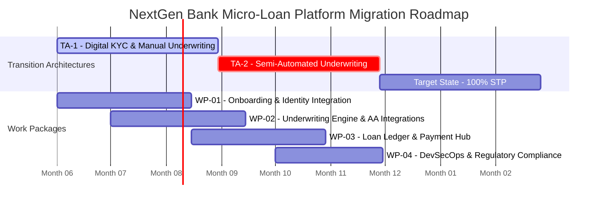

# TOGAF Phase E & F: Migration Roadmap & Work Packages

This document defines the 9-month implementation timeline, detailed work packages (WP-01 to WP-04), dependencies, and the architecture execution rules for NextGen Bank's **Straight-Through Processing (STP) Micro-Loan Mobile Platform**.

---

## 1. Migration Timeline (Gantt Chart)

The following Gantt chart outlines the parallel execution of the work packages and their alignment with the Transition Architectures (TA-1 and TA-2).



---

## 2. Detailed Work Packages

The migration roadmap is structured into four distinct work packages. Each package represents a co-ordinated effort across stream-aligned teams.

### 2.1 Work Package 1: Onboarding & Identity Integration (WP-01)
* **Objective**: Build the mobile frontend and identity verification pipeline.
* **Duration**: Month 1 to Month 3.5 (75 days)
* **Inputs**:
  * Figma UI/UX mock-ups for customer onboarding.
  * API contracts for UIDAI Aadhaar e-KYC and NSDL PAN verification.
* **Core Activities**:
  1. Set up the client-side repository (React Native/Flutter) and integrate local storage for offline state management.
  2. Deploy Kong API Gateway and configure Keycloak OIDC Identity Provider.
  3. Develop the Onboarding Microservice to orchestrate identity checks (UIDAI e-KYC, DigiLocker, PAN, and facial matching).
  4. Build the Back-Office Credit Portal to display uploaded customer documents.
* **Deliverables & Outputs**:
  * Customer Mobile Onboarding Flow (on App Store / Google Play TestFlight).
  * Secure [Onboarding Service](file:///Users/manavshrivastava/Documents/github/untitled%20folder/togaf/architecture_repository/3_architecture_landscape/segment/digital_lending_stp/phase_b_business_architecture.md) linked to identity verification registries.
  * Centralized Identity and Access Management (IAM) framework.
* **Resources Required**:
  * 2 Frontend Engineers, 2 Backend Engineers, 1 UX/UI Designer, 1 QA Engineer.
* **Tech Stack**: React Native/Flutter, Java Spring Boot, Kong Gateway, Keycloak, AWS S3.

---

### 2.2 Work Package 2: Underwriting Engine & Partner Integrations (WP-02)
* **Objective**: Develop the credit decisioning engine and integrate financial data feeds.
* **Duration**: Month 2 to Month 4.5 (75 days)
* **Inputs**:
  * Risk Scorecard criteria approved by the Risk Policy Committee.
  * API documentation for CIBIL/Experian and Decentro AA middleware.
* **Core Activities**:
  1. Build the Python-based Credit Decisioning Engine (FastAPI) to evaluate risk rules.
  2. Integrate Decentro AA SDK into the mobile application.
  3. Implement the statement parser component utilizing Perfios APIs to normalize bank transaction details.
  4. Develop the credit score aggregator to retrieve and parse CIBIL and Experian XML records.
* **Deliverables & Outputs**:
  * [Credit Underwriting Engine](file:///Users/manavshrivastava/Documents/github/untitled%20folder/togaf/architecture_repository/3_architecture_landscape/segment/digital_lending_stp/phase_c_application_architecture.md) service.
  * Account Aggregator Consent Orchestrator.
  * Normalized Credit Data Store containing structured transaction and bureau records.
* **Resources Required**:
  * 2 Python Developers, 1 Data Scientist (Risk Analytics), 1 Integration Specialist, 1 QA.
* **Tech Stack**: Python, FastAPI, PostgreSQL, Redis, Decentro SDK, Perfios APIs.

---

### 2.3 Work Package 3: Loan Ledger & Payment Hub Integration (WP-03)
* **Objective**: Establish the core lending ledger and automated settlement routing.
* **Duration**: Month 3.5 to Month 6 (75 days)
* **Inputs**:
  * Standard loan agreement legal templates.
  * NPCI UPI AutoPay and e-NACH API specs from the Sponsor Bank.
* **Core Activities**:
  1. Deploy Finflux LMS on AWS EKS; configure double-entry accounting schemas.
  2. Implement the Payment Hub service to execute disbursals via IMPS/NEFT/UPI.
  3. Integrate NeSL e-Sign and NSDL e-Sign gateways for legal contract execution.
  4. Integrate UPI AutoPay/eNACH mandate registration flows into the LMS checkout.
* **Deliverables & Outputs**:
  * Cloud-hosted Loan Management System (LMS).
  * Automated Payment Hub linked to the Sponsor Bank.
  * Digital Agreement Execution engine.
* **Resources Required**:
  * 3 Backend Engineers (LMS Specialists), 1 Payments Integration Engineer, 1 QA.
  * 1 DBA.
* **Tech Stack**: Java (Finflux/Fineract Wrapper), MySQL, Kafka, Spring Cloud, Sponsor Bank Host-to-Host APIs.

---

### 2.4 Work Package 4: DevSecOps & Regulatory Compliance Audit (WP-04)
* **Objective**: Hardening the infrastructure, conducting audits, and launching the target 100% STP system.
* **Duration**: Month 5 to Month 7 (60 days)
* **Inputs**:
  * RBI Digital Lending Guidelines audit checklist.
  * DPDP Act technical specifications.
* **Core Activities**:
  1. Harden EKS clusters, configure mTLS using Istio Service Mesh, and implement KMS envelope encryption.
  2. Perform white-box/black-box penetration testing and code vulnerability scans.
  3. Set up Prometheus/Grafana dashboards for real-time compliance and performance tracking.
  4. Execute a full end-to-end sandbox audit with certified auditors to secure RBI and DPDP compliance clearance.
* **Deliverables & Outputs**:
  * Hardened production environments.
  * Penetration Testing and Security Clearance Report.
  * Regulatory Compliance Certification.
  * Target State Production Launch.
* **Resources Required**:
  * 1 DevSecOps Engineer, 1 Security Auditor, 1 Compliance Officer, 2 QA Engineers.
* **Tech Stack**: HashiCorp Vault, AWS KMS, Istio Service Mesh, SonarQube, Prometheus, Grafana.

---

## 3. Work Package Dependencies & Milestones

The following table maps the inter-dependencies between the work packages, indicating how they block or enable the transition architectures.

```
       ┌───────────────────────┐
       │   WP-01: Onboarding   │───► Enables TA-1 (Month 1-3)
       └───────────────────────┘
                   │
                   ▼ (Feeds App Shell & Client State)
       ┌───────────────────────┐
       │   WP-02: Underwriting │───► Enables TA-2 Shadow Underwriting
       └───────────────────────┘
                   │
                   ▼ (Feeds Credit Scoring Inputs)
       ┌───────────────────────┐
       │     WP-03: Ledger     │───► Enables TA-2 Automated Disbursals
       └───────────────────────┘
                   │
                   ▼ (Feeds Functional System Components)
       ┌───────────────────────┐
       │   WP-04: DevSecOps    │───► Enables 100% STP Target State Launch
       └───────────────────────┘
```

| Dependency ID | Pre-requisite WP | Dependent WP / Milestone | Impact of Delay |
| :--- | :--- | :--- | :--- |
| **DEP-01** | **WP-01** (Onboarding) | **WP-02** (Underwriting Engine) | Delay in onboarding prevents the Underwriting Engine from receiving valid customer profile identifiers. |
| **DEP-02** | **WP-02** (Underwriting) | **WP-03** (Ledger & Payments) | The Loan Ledger cannot initialize a credit account without an approved limit recommendation from the Underwriting Engine. |
| **DEP-03** | **WP-03** (Ledger) | **WP-04** (DevSecOps & Audit) | Comprehensive regulatory audit cannot be executed until the payment flows, interest rules, and agreement execution are fully integrated. |
| **DEP-04** | **WP-04** (Audit) | **Target State Launch** | Failure to clear the compliance audit blocks the de-provisioning of manual reviews, preventing target state go-live. |

---

## 4. Architecture Execution Rules

To maintain the architectural integrity of the platform across all four work packages, the NextGen Bank Architecture Board enforces the following execution rules:

### Rule 1: API Versioning and backward compatibility
* All microservice interfaces must follow semantic versioning (`vMAJOR.MINOR.PATCH`).
* Major versions must be isolated in URI paths (e.g., `/api/v1/onboard`).
* Breaking changes must maintain support for the previous major version for a minimum transition period of 90 days.

### Rule 2: API-First Contract Definition
* Developers must define and merge OpenAPI (Swagger) specifications into the central API repository before writing code.
* Changes to contracts must be approved via the Git pull request process by at least one lead architect from the respective team.

### Rule 3: Zero Local Storage of PII
* Client mobile applications must never cache or store customer PII (Aadhaar number, PAN, Bureau data, bank statements) on local device storage.
* Non-PII session tokens must be stored in secure OS-level keychain/keystore wrappers.

### Rule 4: CI/CD Compliance Quality Gates
* Code commits must pass static application security testing (SAST) via SonarQube with zero critical vulnerabilities.
* Automated compliance verification runs in CI/CD: all API gateways must block calls that do not pass authentication signatures or correlation tracking headers.

---

## 5. References & Linked Artifacts

* **Gap Analysis & Solutions**: [gap_analysis_and_solutions.md](file:///Users/manavshrivastava/Documents/github/untitled%20folder/togaf/architecture_repository/3_architecture_landscape/segment/digital_lending_stp/phase_e_f_migration/gap_analysis_and_solutions.md)
* **Transition Architectures**: [transition_architectures.md](file:///Users/manavshrivastava/Documents/github/untitled%20folder/togaf/architecture_repository/3_architecture_landscape/segment/digital_lending_stp/phase_e_f_migration/transition_architectures.md)
* **TCO Financial Model**: [tco_financial_model.md](file:///Users/manavshrivastava/Documents/github/untitled%20folder/togaf/architecture_repository/3_architecture_landscape/segment/digital_lending_stp/phase_e_f_migration/tco_financial_model.md)
* **Compliance Guidelines**: [compliance_guidelines.md](file:///Users/manavshrivastava/Documents/github/untitled%20folder/togaf/architecture_repository/3_architecture_landscape/segment/digital_lending_stp/phase_g_h_governance/compliance_guidelines.md)
