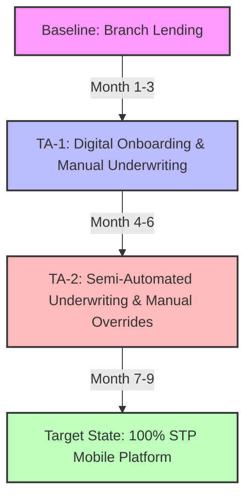
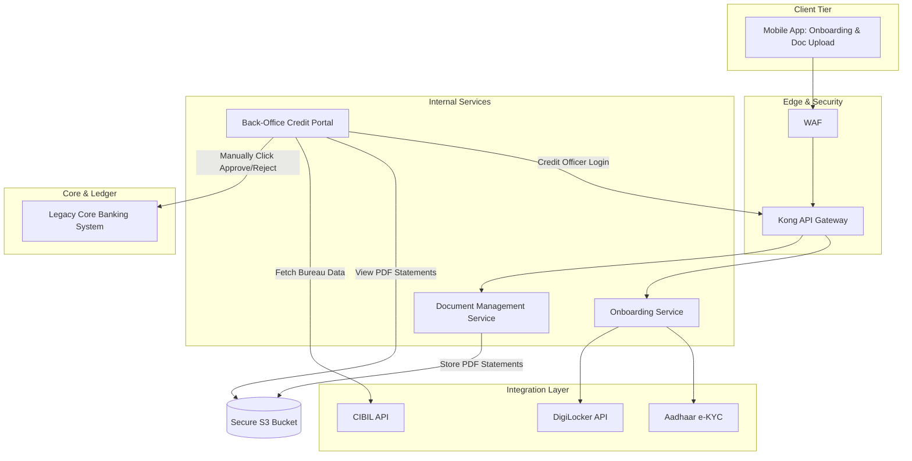
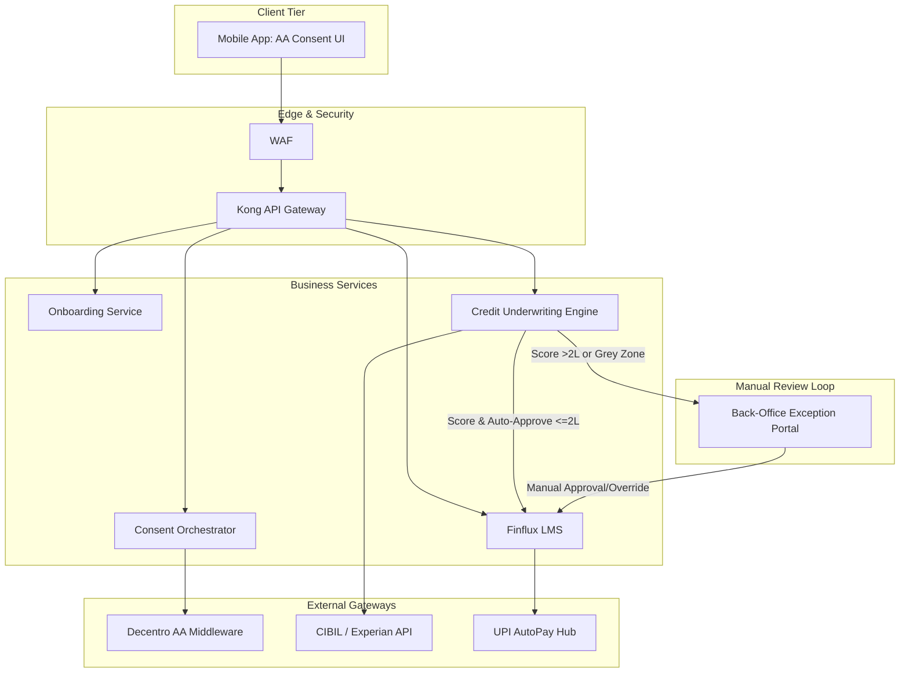

# TOGAF Phase E & F: Transition Architectures (TA)

To mitigate the operational, financial, and credit risks of launching a fully automated, zero-human-intervention micro-loan platform on Day 1, NextGen Bank defines a phased migration path. This document specifies the architectures, system boundaries, and migration milestones for **Transition Architecture 1 (TA-1)** and **Transition Architecture 2 (TA-2)**.

---

## 1. Phased Migration Journey

---

## 2. Transition Architecture 1 (TA-1): Digital KYC & Manual Underwriting

* **Duration**: Months 1 to 3
* **Primary Objective**: Launch the mobile acquisition channel, validate digital onboarding rails, and gather credit performance data while keeping credit risk under strict human control.

### 2.1 Architectural Blueprint (TA-1)
In TA-1, the mobile app frontend is live, but the backend processes rely on manual back-office tasks for underwriting and risk validation.

### 2.2 Functional Flow
1. **Onboarding**: The customer installs the NextGen Bank mobile app, registers via OTP, and inputs their PAN. The Onboarding Service validates the identity via UIDAI Aadhaar e-KYC and DigiLocker APIs.
2. **Document Ingestion**: Instead of using the Account Aggregator (AA) network, the customer is prompted to upload their last 6 months' bank statements as a PDF file.
3. **Underwriting Queue**: Uploaded PDFs are stored in a secure AWS S3 bucket. A webhook notifies the Back-Office Credit Portal, adding the loan application to a manual underwriting queue.
4. **Credit Committee Review**: Credit officers log into the Back-Office Credit Portal, download and review the bank statement PDFs, fetch CIBIL credit history manually, and run traditional credit scoring worksheets.
5. **Decision & Disbursal**: The credit officer manually inputs the approved loan amount and clicks "Approve". The system generates a standard loan agreement, and the client accepts it in the app. Disbursal is triggered via a manual batch file upload (NEFT/IMPS) to the legacy Core Banking System (CBS) at the End of Day (EOD).

### 2.3 System Boundaries & Technical Debt
* **Temporary Document Service**: The PDF upload and storage system (AWS S3 + manual viewer) is a temporary component that will be deprecated once the AA integration is live.
* **Manual Underwriting Database**: A temporary relational database table stores credit officer notes and manual score overrides.
* **High Operational Latency**: Underwriting Turnaround Time (TAT) is restricted by human working hours (Target TAT: 4 to 24 hours).

---

## 3. Transition Architecture 2 (TA-2): Automated Underwriting with Human Override

* **Duration**: Months 4 to 6
* **Primary Objective**: Integrate Account Aggregator (AA) automated data feeds, deploy the Python-based Credit Decisioning Engine in shadow/calibrating mode, and automate low-value loan approvals while maintaining oversight for larger exposure.

### 3.1 Architectural Blueprint (TA-2)
In TA-2, the Account Aggregator network and the Credit Decisioning Engine are live. Automated workflows process loans up to ₹2 Lakh, while human overrides are required for loans above ₹2 Lakh or marginal credit scores.

### 3.2 Functional Flow
1. **Onboarding & Consent**: The customer completes e-KYC. The Consent Orchestrator prompts the client to link their primary bank account using the Account Aggregator (AA) interface. Decentro fetches the structured JSON transaction history.
2. **Automated Risk Scoring**: The Python-based Credit Underwriting Engine fetches real-time credit bureau reports, parses the AA JSON transaction history (average balance, bounce history, salary credits), and calculates an automated Credit Score.
3. **Routing Logic**:
   * **Auto-Approval (Low Risk, Loan <= ₹2 Lakh)**: If the loan amount requested is <= ₹2 Lakh AND the credit score exceeds the high-confidence threshold (e.g., Score > 750), the system bypasses manual review. The LMS automatically generates the contract and registers the UPI AutoPay mandate.
   * **Auto-Rejection (High Risk)**: If the score falls below the risk tolerance floor (e.g., Score < 600), the engine triggers an instant in-app rejection screen displaying alternative credit builders.
   * **Manual Override Queue (Loan > ₹2 Lakh OR Score 600-750)**: If the loan is > ₹2 Lakh, or if the score falls into the "Grey Zone", the application is routed to the Back-Office Exception Portal. A credit officer reviews the system's risk assessment and either approves, rejects, or adjusts the loan limit.
4. **Automated Disbursal**: Once approved (either automatically or via override), disbursal is executed in real-time via the API gateway to the Core Banking System.

### 3.3 System Boundaries & Technical Debt
* **Exception Logging**: Deep logs capture differences between the automated engine recommendations and final human decisions. This is used to retrain the risk scorecard.
* **Dual Routing Orchestration**: Complex routing rules in the API gateway manage the branch logic between automated execution and exception-handling manual cues.

---

## 4. Migration Milestones & Transition Triggers

Progressing between the transition architectures requires satisfying strict performance, security, and credit quality gateways.

### 4.1 Transition Gateway 1: Moving from Baseline to TA-1 (Month 1 Start)
* **Trigger Conditions**:
  1. Completion of WP-01 (Onboarding UI, WAF, Kong API Gateway, UIDAI/PAN verification APIs).
  2. Successful penetration testing and CISO security sign-off of the customer-facing mobile application.
  3. Finalization of manual underwriting guidelines and onboarding of 15 back-office credit officers on the Credit Portal.
  4. Integration of the manual disbursal batch-file generator with the CBS.

### 4.2 Transition Gateway 2: Moving from TA-1 to TA-2 (Month 4 Start)
* **Trigger Conditions**:
  1. **Production Volume**: Minimum of 10,000 active loan applications processed manually during TA-1.
  2. **Data Model Calibration**: Risk models run in "shadow mode" during TA-1 must show a Gini coefficient of **> 0.40** against actual borrower defaults.
  3. **AA Pipeline Integration**: Completion and successful testing of Decentro AA APIs with at least 8 major banks (SBI, HDFC, ICICI, Axis, Kotak, BOB, PNB, Canara).
  4. **System Stability**: Mobile app e-KYC funnel completion rate must be **> 65%** with API latency below 3 seconds.

### 4.3 Transition Gateway 3: Moving from TA-2 to Target State (Month 7 Start)
* **Trigger Conditions**:
  1. **Model Accuracy (Low Defaults)**: First Payment Default (FPD) rate for loans automatically approved in TA-2 must remain below **1.5%**.
  2. **Decision Divergence**: The rate of human credit officers overriding the automated engine's recommendation for Grey Zone loans must drop below **5%** (indicating high scorecard alignment).
  3. **Auto-Pay Mandate Success**: UPI AutoPay registration success rate must exceed **92%** on the NPCI networks.
  4. **Regulatory Audit**: Third-party compliance audit clears the automated underwriting logic under the RBI Digital Lending Guidelines and the DPDP Act.
  5. **Architecture Board Sign-off**: Enterprise Architect and Chief Risk Officer formally sign off on the de-provisioning of the Back-Office Exception Portal.

---

## 5. References & Linked Artifacts

* **Gap Analysis**: [gap_analysis_and_solutions.md](file:///Users/manavshrivastava/Documents/github/untitled%20folder/togaf/architecture_repository/3_architecture_landscape/segment/digital_lending_stp/phase_e_f_migration/gap_analysis_and_solutions.md)
* **Migration Roadmap**: [migration_roadmap.md](file:///Users/manavshrivastava/Documents/github/untitled%20folder/togaf/architecture_repository/3_architecture_landscape/segment/digital_lending_stp/phase_e_f_migration/migration_roadmap.md)
* **Compliance Guidelines**: [compliance_guidelines.md](file:///Users/manavshrivastava/Documents/github/untitled%20folder/togaf/architecture_repository/3_architecture_landscape/segment/digital_lending_stp/phase_g_h_governance/compliance_guidelines.md)
* **SLAs and KPIs**: [slas_and_kpis.md](file:///Users/manavshrivastava/Documents/github/untitled%20folder/togaf/architecture_repository/3_architecture_landscape/segment/digital_lending_stp/phase_g_h_governance/slas_and_kpis.md)
