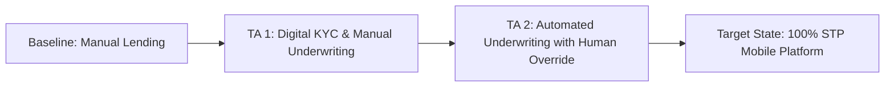

# TOGAF Phase E & Phase F: Opportunities & Solutions, Migration Planning

This document covers **Phase E (Opportunities and Solutions)** and **Phase F (Migration Planning)** for the micro-loan mobile platform. It includes the Gap Analysis, Transition Architectures, Build vs. Buy evaluation, and the project implementation roadmap.

---

## 1. Consolidated Gap Analysis

Before moving to the target architecture, we must bridge gaps across all domains:

| Architecture Domain | Baseline State (Legacy Bank) | Target State (Digital Mobile Platform) | Gap Description & Action |
| :--- | :--- | :--- | :--- |
| **Business** | Branch-based loan officers, manual documentation, human underwriting. | Mobile-only, zero-human-intervention, straight-through processing (STP). | **Gap**: Complete absence of automated risk rules. <br>**Action**: Develop credit decision algorithms and auto-rejection rules. |
| **Data** | Customer data split across silos; manual statement PDFs; no digital consent trail. | Centralized encrypted database, Account Aggregator consent, DPDP-compliant ledger. | **Gap**: Lack of consent audit capability and XML bank parser. <br>**Action**: Build Consent Registry and integrate AA schema parser. |
| **Application** | Monolithic legacy Core Banking System (CBS) running end-of-day batch files. | Decoupled microservices architecture communicating via Kafka event mesh. | **Gap**: CBS cannot handle microservices API loads or instant queries.<br>**Action**: Deploy an isolated Digital Lending Ledger microservice. |
| **Technology** | On-premises VMware servers, manual deployments, static physical HSM. | Hybrid Cloud (AWS/Azure Kubernetes), GitOps CI/CD, cloud-native KMS/HSM. | **Gap**: Deployment bottlenecks; lack of scalable API gateway. <br>**Action**: Deploy Kong Gateway and establish DevSecOps pipelines. |

---

## 2. Build vs. Buy & Vendor Evaluation

To minimize time-to-market while retaining core intellectual property (IP), the bank performs a strict Build vs. Buy analysis:

| Solution Core Component | Option A: In-House Build | Option B: Vendor Purchase / SaaS | Selection & Trade-off |
| :--- | :--- | :--- | :--- |
| **Credit Scoring & Rule Engine** | Develop Python-based FastAPI service running local risk scorecards. | License a third-party risk analysis SaaS (e.g., Perfios / Signzy). | **Selection**: **Build**. Underwriting models are the bank's core IP. Vendor models are black-boxes and costly to modify as risk policy shifts. |
| **Account Aggregator Gateway** | Direct integration with 15+ individual Account Aggregators. | Integrate a single SDK/API middleware (e.g., Decentro / Perfios). | **Selection**: **Buy (Middleware)**. Building connectors to every individual AA is highly complex. Using a middleware saves 6 months of dev effort. |
| **Loan Management System (LMS)** | Build custom ledger, interest accrual, and recovery schedules. | Deploy an open-source core (e.g., Finflux / Apache Fineract) on cloud. | **Selection**: **Hybrid**. Use Apache Fineract as the base double-entry ledger database, wrapped with in-house microservices for custom user actions. |

---

## 3. Transition Architectures (Phased Execution)

Due to the risk of deploying a zero-human-intervention engine from day one, we establish two Transition Architectures (TAs):



### 3.1 Transition Architecture 1: Digital KYC & Manual Underwriting (Month 1-3)
* **Scope**: Launch the mobile app frontend. Implement digital identity checks (Aadhaar e-KYC, DigiLocker).
* **Underwriting**: Customer uploads bank statement PDFs. Credit risk team reviews documents manually via a web dashboard and clicks "Approve/Reject".
* **Benefits**: Validates the customer acquisition funnel and mobile experience while keeping credit risk under human control.

### 3.2 Transition Architecture 2: Automated Underwriting with Human Override (Month 4-6)
* **Scope**: Implement the Account Aggregator (AA) and Credit Bureau API integrations. The Credit Underwriting Engine calculates limits automatically.
* **Underwriting**: The engine recommends approval/limit/rejection. Applications exceeding 2 Lakh INR are routed to a credit officer for quick review. Applications under 2 Lakh are processed automatically.
* **Benefits**: Calibrates the credit scoring models against real-world borrower performance data before removing human oversight.

---

## 4. Migration Roadmap & Work Packages

The implementation is broken down into parallel work streams spanning 9 months:

```
Month 1       Month 2       Month 3       Month 4       Month 5       Month 6       Month 7       Month 8       Month 9
[─── Work Package 1: Onboarding ───]
              [─── Work Package 2: Underwriting Engine ───]
                            [─── Work Package 3: Loan Ledger & Payments ───]
                                          [─── Work Package 4: Testing & Security Audits ───]
```

### Work Package 1: Onboarding & Identity Integration (WP-01)
* **Scope**: Build Mobile App UI, deploy API Gateway, and implement UIDAI/PAN verification APIs.
* **Dependencies**: OIDC Identity Provider setup.
* **Deliverable**: Mobile app onboarding flow (ready for TA-1).

### Work Package 2: Underwriting Engine & Partner Integrations (WP-02)
* **Scope**: Develop the Python risk model, integrate Account Aggregator middleware and Bureau APIs.
* **Dependencies**: Risk rules finalized by the Risk Policy Committee.
* **Deliverable**: Automated scorecard recommendation engine.

### Work Package 3: Loan Ledger & Payment Hub Integration (WP-03)
* **Scope**: Deploy LMS (Apache Fineract wrapper), integrate e-Sign (NeSL) and e-Mandate (UPI AutoPay/eNACH) via Sponsor Bank.
* **Dependencies**: Sponsor bank host-to-host API provisioning.
* **Deliverable**: Automated contract execution and instant disbursal.

### Work Package 4: DevSecOps & Regulatory Compliance Audit (WP-04)
* **Scope**: Security hardening, mTLS setup, penetration testing, RBI Digital Lending Guidelines compliance audit.
* **Dependencies**: Completion of WP-01, WP-02, and WP-03.
* **Deliverable**: Regulatory clearance certificate and production launch.

---

## 5. Migration Risk Register

| Risk ID | Risk Description | Probability | Impact | Mitigation Strategy |
| :--- | :--- | :--- | :--- | :--- |
| **R-MIG-01** | Account Aggregator API latency exceeds mobile timeout thresholds. | High | High | Implement local cache for session states; fallback to asynchronous polling screen displaying "Fetching data" instead of freezing UI. |
| **R-MIG-02** | Fraud via spoofed biometric selfie streams. | Medium | Critical | Mandate 3D passive liveness checks via SDK instead of static photo uploads. |
| **R-MIG-03** | Delay in Sponsor Bank API provisioning for e-Mandates. | Medium | High | Utilize multi-bank routing; maintain integration with two separate sponsor banks (Primary and Secondary). |
| **R-MIG-04** | Credit Underwriting Engine mispricing risk (high defaults). | Low | Critical | Cap loan limits at 50,000 INR for the first 3 months of target launch, dynamically increasing to 10 Lakh as the model proves accurate. |

---

## 6. Financial TCO & Transactional Unit Cost Model (CIO Focus)

To justify the CAPEX for the cloud-native infrastructure, the operational transaction cost model is defined below.

### 6.1 Transactional Cost per Loan Life Cycle (OPEX)
Each loan application and servicing lifecycle incurs direct variable costs paid to India Stack and SaaS partners:

| Life Cycle Phase | Integration Provider | Charge Type | Estimated Cost (INR) |
| :--- | :--- | :--- | :--- |
| **PAN Verification** | CDSL / Income Tax API | Per fetch | ₹1.00 |
| **Aadhaar e-KYC** | UIDAI via KUA | Per verification | ₹3.00 |
| **Biometric Liveness Check** | SaaS Provider API | Per transaction | ₹5.00 |
| **Credit Bureau Pull** | TransUnion CIBIL / Experian | Per pull | ₹12.00 |
| **Bank Statement Parsing** | Account Aggregator / Finvu | Per consent pull | ₹6.00 |
| **Contract Agreement Execution** | NeSL / e-Sign Gateway | Per signed contract | ₹18.00 |
| **Auto-Debit mandate registration** | NPCI e-Mandate / Sponsor Bank | Per registration | ₹5.00 |
| **Disbursal Settlement** | IMPS / UPI | Per transaction | ₹1.50 |
| **Repayment Collection** | UPI AutoPay Pull | Per monthly auto-debit | ₹1.00 |
| **Total Origination Cost** | — | **Single Loan Setup** | **₹52.50** |

### 6.2 CAPEX vs. OPEX Trade-Off
* **Legacy Branch Loan Acquisition Cost**: ~₹2,500 per loan (includes human resource hours, paper archiving, physical verification visits).
* **Target Digital Platform Cost**: ~₹52.50 + Cloud infrastructure overhead of ~₹20 per loan.
* **Result**: >97% reduction in acquisition cost, enabling high profitability even for micro-loans of 10,000 INR.

