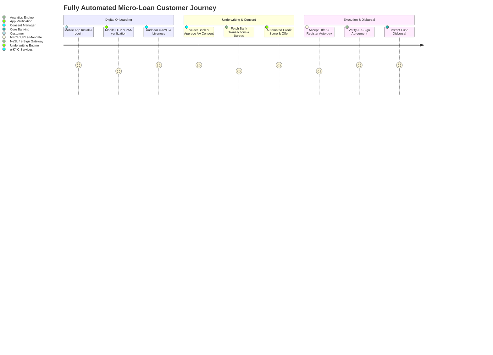

# TOGAF Preliminary Phase & Phase A: Architecture Vision

This document details the **Preliminary Phase** (establishing the architecture capability, governance, and principles) and **Phase A (Architecture Vision)** for NextGen Bank's **Straight-Through Processing (STP) Micro-Loan Mobile Platform**.

---

## 1. Preliminary Phase: Framework & Principles

### 1.1 Organisational Scope
The scope of this architecture is the **Digital Lending Unit (DLU)** of NextGen Bank. It interfaces with the Core Banking Systems (CBS), Treasury, Risk Control, Information Security, and regulatory reporting systems.

### 1.2 Architecture Governance Framework
The architecture is governed by the **NextGen Bank Architecture Board**. Any deviation from these architectural designs must go through a formal architecture waiver process. Reviews are conducted at every stage of implementation.

### 1.3 Architecture Principles
These core principles guide all design and implementation decisions for the micro-loan platform.

#### Principle 1: Straight-Through Processing First (STP-First)
* **Statement**: The platform must execute the entire loan lifecycle from customer onboarding to final loan closure with 100% automated orchestration and zero manual back-office tasks.
* **Rationale**: The target demographic (young generation) expects instant feedback. Manual interventions introduce operational bottlenecks, human errors, and scale constraints.
* **Implications**: Every edge-case must have automated logic (fallback models, automated fraud checks, retry queues). Manual reviews are disallowed; applications failing automated criteria are instantly rejected or automatically rerouted to alternative verification.

#### Principle 2: API-First & Interoperable Ecosystem
* **Statement**: All internal systems must expose functionality via secure, versioned microservice APIs. External integrations must rely on standard interfaces (Account Aggregator, e-KYC, e-Sign, e-Mandate).
* **Rationale**: Fast time-to-market requires seamless integration with fintech partnerships and the India Stack. Decoupling services ensures continuous deployments and resilience.
* **Implications**: API schemas must be defined before code writing (OpenAPI Spec/gRPC). Direct database sharing between services is prohibited. Partner APIs must be mediated via a secure gateway.

#### Principle 3: Compliance & Privacy by Design
* **Statement**: Architecture must comply with the DPDP (Digital Personal Data Protection) Act and RBI Digital Lending Guidelines (DLG) from the design phase.
* **Rationale**: Regulatory non-compliance carries heavy financial and reputational risks, including operational suspension. Data security protects both the bank and the customer.
* **Implications**: Consent must be explicit, granular, revocable, and audited. Customer PII must be encrypted at rest and in transit. No customer data can be shared with third parties without specific consent logged on the Consent Manager (DEPA). All funds must flow directly between the bank's account and the borrower's verified bank account without intermediaries.

#### Principle 4: Mobile-First & Dynamic Experience
* **Statement**: The application UI must be responsive, low-latency, and optimized for dynamic client-side experiences (including low network situations).
* **Rationale**: Target users are mobile-native. Slow screen loading leads to high drop-offs.
* **Implications**: The frontend must load key components offline or on poor network conditions, caching non-sensitive elements. API payloads must be optimized, and network requests minimized.

---

## 2. Phase A: Architecture Vision

### 2.1 Problem Statement & Solution Objectives
* **Market Problem**: Traditional loan processes require physical documents, physical verification, and days of underwriting. Younger demographics need micro-loans (10k to 10 Lakh INR) instantly for education, equipment, travel, or cash-flow management.
* **Solution Vision**: A state-of-the-art mobile app enabling 5-minute approval and disbursement via an end-to-end digital pipeline utilizing Aadhaar e-KYC, Credit Bureaus, Account Aggregators (AA), e-Sign, and UPI Auto-Pay.

### 2.2 Stakeholder Map & Engagement Matrix

| Stakeholder Group | Concerns | Engagement Strategy | Artifacts of Interest |
| :--- | :--- | :--- | :--- |
| **Board of Directors** | ROI, market capture, brand positioning | Quarterly review | Business Vision, Roadmap |
| **Chief Risk Officer (CRO)** | Default rates, credit risk, fraud, automated underwriting model | Bi-weekly alignment | Underwriting rules, Bureau integration |
| **Chief Compliance Officer** | RBI DLG guidelines, DPDP Act, AML (Anti-Money Laundering) | Weekly reviews | Consent logs, e-KYC trails |
| **Chief Technology Officer (CTO)**| Scale, availability, technical debt, licensing cost | Architecture Board | Application & Technology Architecture |
| **Security Team (CISO)** | Data leaks, API vulnerability, authorization models | Penetration testing & audit | Security guidelines, KMS, OIDC specs |
| **Customer Segment (Gen-Z)** | Speed, UX, interest rates, transparent charges | Focus groups, app telemetry | User Journey, UI wireframes |

### 2.3 High-Level Business Capability Model
The core capabilities required to realize the business goal are:
1. **Onboarding & Identity Verification**: Aadhaar e-KYC, DigiLocker, PAN verification, Video/Photo Liveness Check.
2. **Consent Management**: Account Aggregator integration, Dynamic consent UI, Audit logging.
3. **Credit Risk Underwriting**: Bureau check, AA Statement analyzer, Devicetelemetry fraud engine, Scorecard assessment.
4. **Loan Servicing & Lifecycle**: Loan management (interest, penalty calculation), Ledger, Payment schedule, Recovery engine.
5. **Payment Orchestration**: UPI Auto-pay, e-NACH mandate, Disbursal engine (IMPS/NEFT/UPI).
6. **Regulatory Reporting**: RBI DLG dashboard, automated Credit Bureau reporting, audit logs.

### 2.4 Value Stream Mapping (Customer Journey)



### 2.5 Target State Architecture Vision

```mermaid
graph TB
    subgraph Client Tier
        App[Mobile App: iOS / Android]
    end
    
    subgraph Edge & Security
        WAF[Web Application Firewall]
        AG[API Gateway: Kong/Apigee]
        IAM[OIDC Identity Provider: Keycloak]
    end
    
    subgraph Business Services Domain
        Onboard[Onboarding Service]
        Consent[Consent Orchestrator]
        Risk[Credit Underwriting Engine]
        LMS[Loan Management System]
        Pay[Payment Hub]
    end
    
    subgraph Integration Layer (India Stack)
        UIDAI[Aadhaar e-KYC]
        AA[Account Aggregator]
        Bureau[CIBIL / Experian]
        NPCI[UPI AutoPay / eNACH]
        eSign[NSDL e-Sign / NeSL]
    end
    
    subgraph Data & Core Systems
        CBS[Core Banking System]
        DataLake[Real-Time Analytics & Risk Models]
    end

    App --> WAF
    WAF --> AG
    AG --> IAM
    AG --> Onboard
    AG --> Consent
    AG --> Risk
    AG --> LMS
    AG --> Pay
    
    Onboard --> UIDAI
    Consent --> AA
    Risk --> Bureau
    Risk --> DataLake
    Pay --> NPCI
    Pay --> CBS
    LMS --> eSign
```

### 2.6 Architecture Trade-offs

| Alternative | Pros | Cons | Decision |
| :--- | :--- | :--- | :--- |
| **Real-time Account Aggregator (AA) vs. PDF Bank Statement Upload** | 100% digital, untamperable data, high auto-parse success. | Integration complexity, dependency on AA ecosystem uptime. | **Decision**: AA integration. PDF upload is rejected to avoid document tampering and fraud. |
| **Direct Core Banking (CBS) Integration vs. Isolated Digital Lending Ledger** | Real-time balance updates, direct settlement. | CBS limits scalability, high API latency, risk of downtime. | **Decision**: Isolated Digital Lending Ledger for fast transaction processing, with EOD settlement batch processes sync'd to CBS. |
| **In-house Rule Engine vs. Vendor Underwriting SaaS** | IP retention, zero licensing costs per loan, complete rule flexibility. | Longer development time, model training delay. | **Decision**: Hybrid approach. In-house microservice with rule parameters configured via business-managed JSON, utilizing open-source scoring packages. |

### 2.7 Team Topologies (Conway's Law Alignment)
To align software delivery with the decoupled microservices architecture, the development unit is organized into four core teams using the Team Topologies framework:

1. **Onboarding & Consent Team (Stream-Aligned)**:
   - *Scope*: Customer acquisition frontend (Mobile App), identity verification APIs (e-KYC, DigiLocker, PAN), and Account Aggregator consent flows.
   - *Key KPI*: Funnel conversion rate, e-KYC response latency.
2. **Risk & Underwriting Team (Stream-Aligned)**:
   - *Scope*: Real-time Credit Decisioning models (Python/FastAPI Engine), bureau scraper adapters, fraud checks, and risk database.
   - *Key KPI*: Gini coefficient of models, underwriting API latency, default rate (FPD).
3. **Ledger & Settlement Team (Stream-Aligned)**:
   - *Scope*: Loan Management System ledger core (Java Fineract wrapper), repayment schedules, interest accruals, and direct disbursal/auto-debit integration.
   - *Key KPI*: Ledger reconciliation accuracy, loan servicing uptime.
4. **Platform Engineering Team (Platform)**:
   - *Scope*: Shared Kubernetes infra (EKS/AKS), CI/CD pipelines, Istio service mesh, centralized key management (KMS/Vault), and network security.
   - *Key KPI*: Cluster deployment time, pipeline execution speed, system uptime.

