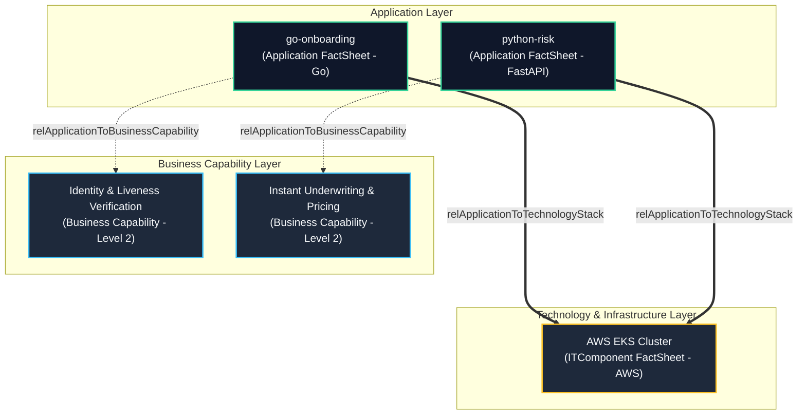

# Reference Library: ArchiMate Models & EAM Imports

This directory contains sample model export files and EAM platform configurations mapping the NextGen Bank Micro-Loan platform architecture. These assets serve as standard starting points for enterprise modeling efforts.

---

## 📂 Available Modeling Assets

### 1. Native Archi Model File
*   **Filename**: [micro_loan_platform.archimate](file:///Users/manavshrivastava/Documents/github/untitled%20folder/togaf/architecture_repository/5_reference_library/archimate_models/micro_loan_platform.archimate)
*   **Description**: A native XML-based model file built for the **Archi** open-source visual modeling tool.
*   **How to Use**:
    1. Open the Archi application.
    2. Go to `File` -> `Open...` and select `micro_loan_platform.archimate`.
    3. The model will load with the Strategy, Business, Application, and Technology element trees and predefined realization links.

### 2. Standard ArchiMate Exchange File
*   **Filename**: [micro_loan_exchange_model.xml](file:///Users/manavshrivastava/Documents/github/untitled%20folder/togaf/architecture_repository/5_reference_library/archimate_models/micro_loan_exchange_model.xml)
*   **Description**: An XML file conforming to The Open Group's **ArchiMate Model Exchange File Format Standard v3.0**.
*   **How to Use**:
    - Use this file to import the model into other commercial EAM platforms such as **LeanIX**, **BiZZdesign Horizzon**, or **Sparx Systems Enterprise Architect**.
    - In your target tool, locate the `Import ArchiMate Exchange File` feature and select this document.

### 3. LeanIX Fact Sheet Import Payload
*   **Filename**: [leanix_fact_sheets_import.json](file:///Users/manavshrivastava/Documents/github/untitled%20folder/togaf/architecture_repository/5_reference_library/archimate_models/leanix_fact_sheets_import.json)
*   **Description**: A JSON array matching LeanIX's REST API import schema to populate applications, business capabilities, and technology component inventories.
*   **How to Use**:
    - Push this JSON array via a curl script to the `/api/v1/factSheets/import` endpoint of your LeanIX workspace instance to populate fact sheets and map relationships automatically.

---

## 📊 Visual Representation of the LeanIX Fact Sheets Import Model

The diagram below shows the ArchiMate layers, the FactSheets, and the relationships defined within [leanix_fact_sheets_import.json](file:///Users/manavshrivastava/Documents/github/untitled%20folder/togaf/architecture_repository/5_reference_library/archimate_models/leanix_fact_sheets_import.json):

