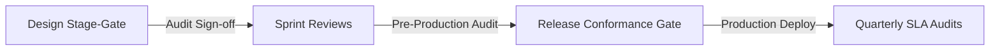

# TOGAF Deliverable Template: Architecture Contract

An **Architecture Contract** is the formal agreement between the Architecture Board and the implementation teams/vendors. It defines the conformance parameters, SLAs, stage-gates, and the process for managing architectural deviations.

---

## 1. Document Control & Parties to the Agreement

| Field | Description |
| :--- | :--- |
| **Document Title** | Architecture Contract |
| **Project/Initiative** | [Project Name] |
| **Contract ID** | CON-YYYY-XXXX |
| **Date** | [YYYY-MM-DD] |
| **Governing Authority** | NextGen Bank Architecture Board |
| **Implementation Party** | [Engineering Team Name / Vendor Name] |
| **Status** | [Draft / Approved / Active] |

### Signatures of Agreement
By signing below, all parties commit to implementing the system in compliance with the target architecture and SLAs defined in this contract.

*   **For the Architecture Board**: \_\_\_\_\_\_\_\_\_\_\_\_\_\_\_\_\_\_\_\_\_ (Date: \_\_\_\_\_\_\_\_\_\_)
*   **For the Implementation Team**: \_\_\_\_\_\_\_\_\_\_\_\_\_\_\_\_\_\_\_\_\_ (Date: \_\_\_\_\_\_\_\_\_\_)

---

## 2. Scope & Target Architecture Reference

This contract governs the implementation of the system described in the following architectural documents:
*   **Architecture Vision**: [Title & Link to Vision Document]
*   **Architecture Definition Document**: [Title & Link to ADD]
*   **Architecture Requirements Specification**: [Title & Link to Requirements Document]

---

## 3. Conformance Requirements

The implementation team must adhere to the following core architectural standards:

| Domain | Standard/Rule to Conform To | Mandatory Component (SBB) | Conformance Metric |
| :--- | :--- | :--- | :--- |
| **Security** | OIDC OAuth2 authorization with PKCE | Keycloak IAM | Zero static api keys in client apps |
| **Data** | PII Tokenization & KMS Encrypted | User DB & Vault | No plain-text PAN/Aadhaar stored |
| **Regulatory** | Explicit Consent logging | Node-Consent / AA | Consent audit log generated for each query |
| **Engineering** | Microservices database isolation | Postgres schemas | Direct cross-database joins prohibited |

---

## 4. System SLAs & Performance Targets

The target system must satisfy the following SLAs:

*   **API Response Uptime**: [e.g., 99.99% availability of public gateway endpoints.]
*   **API Gateway Latency**: [e.g., Response time < 200ms for 95th percentile requests under load.]
*   **Automated Verification Processing Time**: [e.g., Onboarding-to-disbursal workflow must complete under 5 minutes.]
*   **Error Rate Tolerance**: [e.g., HTTP 5xx errors must not exceed 0.05% of total request volume.]

---

## 5. Review Stage-Gates & Conformance Audits

To ensure compliance, the Architecture Board will conduct audits at the following stage-gates:

1.  **Gate 1 (Design Sign-off)**: Prior to commencing backend coding. Validates microservices interface designs and schemas.
2.  **Gate 2 (Release Gate)**: Prior to staging deployment. Validates test coverage (> 85%), automated circuit breakers, and vulnerability scans.
3.  **Gate 3 (Production Deploy Gate)**: Final sign-off. Confirms KMS keys are securely provisioned and zero trust networks are active.

---

## 6. Deviation & Waiver Governance

*   **Waiver Process**: If the implementation team cannot meet any requirement or SLA in this contract, they must submit an **Architecture Waiver Request** immediately.
*   **Remediation Timelines**: Approved waivers are valid for a maximum of 180 days. The implementation team is responsible for resolving the deviation within this timeframe.
*   **Dispute Escalation**: If the implementation team and the Lead Architect cannot resolve a conformance dispute, the matter will be escalated to the Architecture Board Chairperson for final arbitration.
