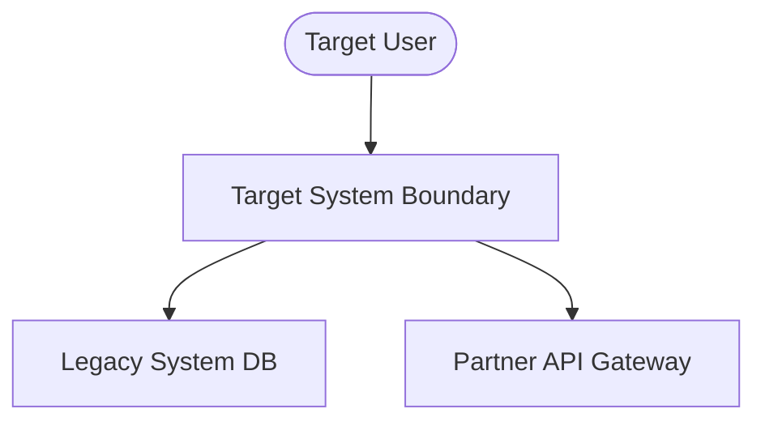

# TOGAF Deliverable Template: Architecture Vision

This document details the **Architecture Vision** for the proposed project. It defines the high-level business objectives, system boundaries, stakeholder maps, value metrics, and target-state concepts.

---

## 1. Document Control & Metadata

| Field | Description |
| :--- | :--- |
| **Document Title** | Architecture Vision |
| **Project/Initiative** | [Project Name] |
| **Author(s)** | [Name / Role] |
| **Date** | [YYYY-MM-DD] |
| **Status** | [Draft / Under Review / Approved] |
| **Approved By** | [Sponsor Name & Architecture Board Chairperson] |
| **Version** | [0.1, 1.0, etc.] |

---

## 2. Project Context & Objectives

### 2.1 Problem Statement
[Describe the business pain points, operational constraints, or market opportunities driving this project.]

### 2.2 Solution Objectives
[Outline the concrete business goals that the proposed solution must achieve to address the problem statement.]

---

## 3. Boundary Map & System Context

### 3.1 Architecture Scope
Define what is in-scope and out-of-scope for the design effort:

```
┌─────────────────────────────────────────────────────────────────────────────┐
│                            ARCHITECTURE BOUNDARY                            │
├──────────────────────────────────────────┬──────────────────────────────────┤
│ IN-SCOPE                                 │ OUT-OF-SCOPE                     │
├──────────────────────────────────────────┼──────────────────────────────────┤
│ - [e.g., Target microservices APIs]      │ - [e.g., Legacy billing engines] │
│ - [e.g., Customer-facing mobile apps]    │ - [e.g., Hardware hosting site]  │
└──────────────────────────────────────────┴──────────────────────────────────┘
```

### 3.2 System Context Diagram
[Include a mermaid diagram or text description illustrating how the system boundary interacts with external ecosystems, internal legacy systems, and user profiles.]



---

## 4. Stakeholder Map & Engagement Plan

Identify the key stakeholders, their primary concerns, and how they will be engaged during the project lifecycle:

| Stakeholder Group | Key Concerns | Engagement Strategy | Artifacts of Interest |
| :--- | :--- | :--- | :--- |
| **Executive Sponsors** | ROI, Time-to-Market, Alignment | Monthly reviews, dashboards | Vision, Roadmap |
| **Security Team** | Data privacy, Key custody, IAM | Weekly design reviews | Security specifications, Threat model |
| **Compliance Officer** | Audit trails, Legal restrictions | Stage-Gate sign-offs | Compliance audits, Consent flows |
| **Engineering Leads** | Scalability, Tech debt, Standards | Daily/Weekly design syncs | APIs, Topology, Code standards |

---

## 5. Target-State Architecture Concept

Provide a high-level summary of the target architecture across the four core domains:

### 5.1 Business Architecture
[Describe the target business processes, customer journey touchpoints, and operational changes.]

### 5.2 Data Architecture
[Describe key data models, security tags, tokenization rules, and storage lifecycles.]

### 5.3 Application Architecture
[Describe the component layout, microservices, API strategy, and integration patterns.]

### 5.4 Technology Architecture
[Describe the hosting infrastructure, cloud providers, container orchestration, and network security.]

---

## 6. Value Proposition & Business Metrics

### 6.1 Value Metrics & KPIs
*   **Metric 1**: [e.g., Reduction in cycle time from X hours to Y minutes]
*   **Metric 2**: [e.g., Target API response time < X milliseconds]
*   **Metric 3**: [e.g., Conversion rate target > X%]

### 6.2 Key Architecture Risks & Mitigations

| Risk Description | Impact | Probability | Mitigation Strategy |
| :--- | :--- | :--- | :--- |
| **Risk 1** (e.g., Third-party API down) | High | Medium | [e.g., Circuit breakers, fallback queues] |
| **Risk 2** (e.g., Data breach of customer logs) | Critical | Low | [e.g., Encryption with KMS, PII tokenization] |
