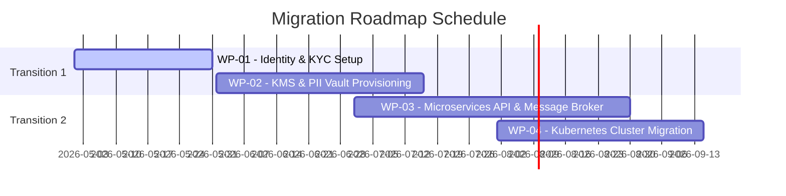

# TOGAF Deliverable Template: Transition Architecture & Migration Roadmap

This document outlines the **Transition Architectures** (phased interim states) and the **Migration Roadmap** (work packages, schedules, and dependencies) for moving from the Baseline Architecture to the Target Architecture.

---

## 1. Document Control & Metadata

| Field | Description |
| :--- | :--- |
| **Document Title** | Transition Architecture & Migration Roadmap |
| **Project/Initiative** | [Project Name] |
| **Author(s)** | [Name / Role] |
| **Date** | [YYYY-MM-DD] |
| **Status** | [Draft / Under Review / Approved] |
| **Approved By** | [Sponsor / Architecture Board Chairperson] |
| **Version** | [0.1, 1.0, etc.] |

---

## 2. Consolidated Gap Analysis Summary

A summary of gaps identified across the ADM domains (Business, Data, Application, Technology):

| Domain | Gap ID | Description of Gap | Proposed Solution / Work Package | Target Phase |
| :--- | :--- | :--- | :--- | :---: |
| **Business** | GAP-BUS-01 | [e.g., Liveness checks are currently manual] | [e.g., Integrate Biometric SDK (WP-01)] | Phase 1 |
| **Data** | GAP-DAT-01 | [e.g., Customer PAN/Aadhaar stored in plain text] | [e.g., Implement KMS PII Tokenization Vault (WP-02)] | Phase 1 |
| **Application** | GAP-APP-01 | [e.g., Direct database writes between Ledger and App] | [e.g., Establish API integration & Kafka event queue (WP-03)]| Phase 2 |
| **Technology**| GAP-TEC-01 | [e.g., Single server deployment; no autoscaling] | [e.g., Migrate to Kubernetes container cluster (WP-04)] | Phase 2 |

---

## 3. Work Package Portfolio

The migration is divided into distinct, manageable projects (Work Packages).

### Work Package 1: [WP-01 Name]
*   **Description**: [Describe the project scope]
*   **Target Gaps Addressed**: [Gap IDs]
*   **Deliverables**: [What will be built?]
*   **Estimated Cost / Effort**: [CAPEX / OPEX / Person-Months]
*   **Business Value & Benefit**: [Strategic value, risk reduction]
*   **Dependencies**: [Prior work packages required]

### Work Package 2: [WP-02 Name]
*   **Description**: [Describe the project scope]
*   **Target Gaps Addressed**: [Gap IDs]
*   **Deliverables**: [What will be built?]
*   **Estimated Cost / Effort**: [CAPEX / OPEX / Person-Months]
*   **Business Value & Benefit**: [Strategic value, risk reduction]
*   **Dependencies**: [Prior work packages required]

---

## 4. Transition Architectures (Interim States)

To manage implementation risk, the migration is structured into phased transition states:

```
┌─────────────────┐       ┌────────────────────────┐       ┌────────────────────────┐       ┌─────────────────┐
│ BASELINE STATE  │ ────> │ TRANSITION STATE 1     │ ────> │ TRANSITION STATE 2     │ ────> │  TARGET STATE   │
│   (Current)     │       │ (TA-1: Hybrid Core)   │       │ (TA-2: Full Cloud-Nat) │       │   (Fully STP)   │
└─────────────────┘       └────────────────────────┘       └────────────────────────┘       └─────────────────┘
```

### 4.1 Transition Architecture 1 (TA-1): [Title/Theme]
*   **Target Completion Date**: [YYYY-MM-DD]
*   **Scope & Objective**: [Description of TA-1 parameters]
*   **Architecture Characteristics**:
    *   *Business*: [Interim processes]
    *   *Data & App*: [Temporary database syncs / API adapters]
    *   *Technology*: [Co-existence infra]
*   **Risks & Mitigation**: [Temporary security or performance risks during TA-1]

### 4.2 Transition Architecture 2 (TA-2): [Title/Theme]
*   **Target Completion Date**: [YYYY-MM-DD]
*   **Scope & Objective**: [Description of TA-2 parameters]
*   **Architecture Characteristics**:
    *   *Business*: [Process changes]
    *   *Data & App*: [Deprecation of old services]
    *   *Technology*: [Expanded cloud deployment]
*   **Risks & Mitigation**: [Mitigations for final transition]

---

## 5. Migration Roadmap & Timeline

### 5.1 Project Schedule (Gantt Chart Representation)
[Include a mermaid Gantt chart mapping out the execution of the Work Packages across the project timeline.]



### 5.2 Dependency Matrix

| Work Package ID | Prerequisite Projects | Blocking Projects | Key Resources Required |
| :--- | :--- | :--- | :--- |
| **WP-01** | None | WP-03 | Identity Integrations Specialist |
| **WP-02** | None | WP-03, WP-04 | Security Engineer / KMS Specialist |
| **WP-03** | WP-01, WP-02 | WP-04 | Microservices Developers |
| **WP-04** | WP-03 | None | Platform / DevOps Engineers |
