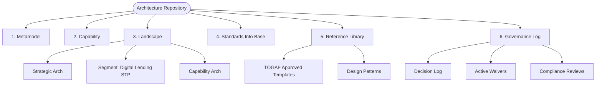

# Enterprise Architecture Repository

This repository represents the formal **Enterprise Architecture (EA) Repository** for NextGen Bank, structured in compliance with the **TOGAF Standard (Version 10)**. It serves as the single source of truth for architecture assets, capability definitions, reference libraries, standards, and governance logs.

---

## 📂 Repository Structure

The architecture repository is organized into six core classes of architectural information:

### 📐 1. Architecture Metamodel
*   **Path**: [1_architecture_metamodel/](file:///Users/manavshrivastava/Documents/github/untitled%20folder/togaf/architecture_repository/1_architecture_metamodel/README.md) (Note: actual relative folder is [1_architecture_metamodel/](file:///Users/manavshrivastava/Documents/github/untitled%20folder/togaf/architecture_repository/1_architecture_metamodel))
*   **Contents**: Describes the organizationally tailored application of the architecture framework, core design principles, and modeling methodologies.
*   **Key Files**:
    - [architecture_principles.md](file:///Users/manavshrivastava/Documents/github/untitled%20folder/togaf/architecture_repository/1_architecture_metamodel/architecture_principles.md): Core design guiding rules (STP-First, API-First, Compliance).

### 🏛️ 2. Architecture Capability
*   **Path**: [2_architecture_capability/](file:///Users/manavshrivastava/Documents/github/untitled%20folder/togaf/architecture_repository/2_architecture_capability)
*   **Contents**: Defines the parameters, structures, processes, and charters that support governance of the Architecture Repository and projects.
*   **Key Files**:
    - [governance_framework.md](file:///Users/manavshrivastava/Documents/github/untitled%20folder/togaf/architecture_repository/2_architecture_capability/governance_framework.md): Architecture Board charter, stage-gates, and waiver process.

### 🗺️ 3. Architecture Landscape
*   **Path**: [3_architecture_landscape/](file:///Users/manavshrivastava/Documents/github/untitled%20folder/togaf/architecture_repository/3_architecture_landscape)
*   **Contents**: Detailed baseline and target representations of the operating enterprise at different levels of granularity (Strategic, Segment, Capability).
*   **Key Segment**:
    - **Digital Lending STP**: Complete ADM outputs for the mobile micro-loan platform (Phases A through H).
    - [Digital Lending Index](file:///Users/manavshrivastava/Documents/github/untitled%20folder/togaf/architecture_repository/3_architecture_landscape/segment/digital_lending_stp/README.md)

### 📚 4. Standards Information Base (SIB)
*   **Path**: [4_standards_information_base/](file:///Users/manavshrivastava/Documents/github/untitled%20folder/togaf/architecture_repository/4_standards_information_base)
*   **Contents**: Defines the industry and internal standards with which architectures must comply (security, regulatory, communications).

### 🔖 5. Reference Library
*   **Path**: [5_reference_library/](file:///Users/manavshrivastava/Documents/github/untitled%20folder/togaf/architecture_repository/5_reference_library)
*   **Contents**: Guidelines, architectural patterns, and reusable **TOGAF Approved Deliverable Templates** to accelerate future designs.
*   **Templates Included**: Principles, Statement of Work, Vision, ADD, Requirements Specification, Roadmap, Contract, Waiver, and Compliance Assessment.

### 📋 6. Governance Log
*   **Path**: [6_governance_log/](file:///Users/manavshrivastava/Documents/github/untitled%20folder/togaf/architecture_repository/6_governance_log)
*   **Contents**: Record of governance activities, board decisions, compliance reviews, and active waiver registries.

---

## 🧭 Navigation Portal Map

