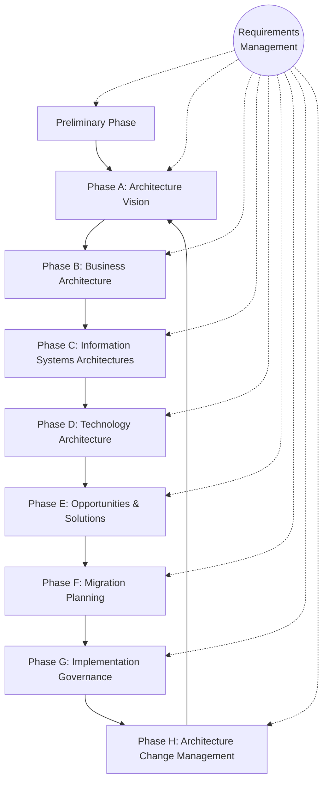

# TOGAF® Enterprise Architecture Foundation - Exam Preparation Topics

This study guide contains a consolidated summary of key topics for the TOGAF® Enterprise Architecture Foundation exam, extracted directly from the official training slides. It is organized into thematic areas to optimize retention of core definitions, characteristics, templates, and ADM lifecycle phases.

> [!TIP]
> * For a quick lookup of topics by slide page numbers, refer to the [TOGAF Page to Topic Mapping](file:///Users/manavshrivastava/Documents/github/resume/togaf/togaf_page_to_topic_mapping.md).
> * For a condensed, high-density study revision sheet, check out the [TOGAF Exam Cheatsheet](file:///Users/manavshrivastava/Documents/github/resume/togaf/togaf_exam_cheatsheet.md).
> * For a full alphabetical glossary of all critical definitions, refer to the [TOGAF Exam Glossary](file:///Users/manavshrivastava/Documents/github/resume/togaf/togaf_exam_glossary.md).

---

## Table of Contents
1. [Core Definitions & Architecture Scope](#1-core-definitions--architecture-scope)
2. [The TOGAF Standard Framework & Suitability](#2-the-togaf-standard-framework--suitability)
3. [Purpose & Benefits of Enterprise Architecture](#3-purpose--benefits-of-enterprise-architecture)
4. [Architecture Development Method (ADM) Overview](#4-architecture-development-method-adm-overview)
5. [Key Concepts: Stakeholders, Concerns, Views & Viewpoints](#5-key-concepts-stakeholders-concerns-views--viewpoints)
6. [Phase Details: Preliminary Phase & Architecture Principles](#6-phase-details-preliminary-phase--architecture-principles)
7. [Phase Details: Phase A, Requests, & Communications](#7-phase-details-phase-a-requests--communications)
8. [Business Scenarios & Requirements Specification](#8-business-scenarios--requirements-specification)

---

## 1. Core Definitions & Architecture Scope

### Enterprise - Definition
An **enterprise** is any collection of organizations that have common goals.
* **Scope:** Can represent an entire enterprise or one or more specific areas of interest.
* **Composition:** May comprise multiple enterprises; may include partners, suppliers, customers, and internal business units.
* **System Perspective:** Considered as a system.
* **Independent EAs:** An enterprise may develop and maintain several independent Enterprise Architectures.
* **Examples:** A corporation vs. a division of a corporation, a government agency vs. a single government department, partnerships and alliances of businesses.

---

### Architecture Domains (BDAT)
The BDAT Architecture Domains divide an Enterprise Architecture into four fundamental subsets:

| Domain | Description | Exam Key Focus |
| :--- | :--- | :--- |
| **Business Architecture** | Defines the business strategy, governance, organization, and key business processes. | Business strategy & processes |
| **Data Architecture** | Describes the structure of an organization's conceptual, logical, and physical data assets and data management resources. | Data assets & management |
| **Application Architecture** | Provides a blueprint for the individual applications to be deployed, their interactions, and their relationships to core business processes. | Application blueprints & interactions |
| **Technology Architecture** | Describes the digital architecture and the logical software/hardware infrastructure capabilities and standards required to support the deployment of business, data, and application services. | Software/hardware infrastructure & standards |

> [!NOTE]
> The domains can be considered individually or holistically. Specific combined domains also exist, such as *Digital Architecture* or *Risk & Security Architectures*.

---

### Scoping Architectures
Four dimensions define and limit the scope of an architecture effort:

1. **Enterprise Scope (Breadth):**
   * *Question:* What is the full extent of the enterprise, and what part of that extent will this architecting effort deal with?
   * *Elements:* Organizations, business units, departments, processes.
2. **Level of Detail (Depth):**
   * *Question:* To what level of detail should the architecting effort go?
   * *Trade-off:* How much architecture is "enough" (finding the balance between architecture and detailed system design & development)?
3. **Architecture Domains:**
   * *Question:* Which domains should be looked at?
   * *Options:* Business, Data, Application, and/or Technology.
4. **Time Period (Planning Horizon):**
   * *Question:* What is the time period that needs to be articulated for the Architecture Vision?
   * *Practicality:* Does it make sense (given practicality, resources) to cover this in a detailed Architecture Description?

> [!IMPORTANT]
> The scope of the architectural activity is mostly limited by **people, finance, objectives, stakeholder concerns**, and the **organisational authority of the EA team**.

---

### Architecture Levels
The architecture landscape is divided into three levels of granularity to provide an organizing framework for change and operations:
1. **Strategic Architecture:** Supports direction setting at an executive level.
2. **Segment Architecture:** Supports direction setting and the development of architecture roadmaps at a program or portfolio level.
3. **Capability Architecture:** Supports the development of effective architecture roadmaps realizing capability increments.

---

### Architecture Abstraction Levels (Layering)
Architecture effort is divided into four distinct levels of abstraction, moving from high-level models to more detailed models. These levels cross the Architecture Domains:
* **Contextual Abstraction:** Understand the environment of an enterprise and the context of architecture work (e.g., scope, motivation, drivers, goals, objectives).
* **Conceptual Abstraction:** Understand the problem (e.g., requirements, business services, application services, technology services).
* **Logical Abstraction:** Identify implementation-independent components to achieve the services of the conceptual abstraction (e.g., business, data, application, and technology components).
* **Physical Abstraction:** Find alternatives for allocation and implementation of physical components to meet the logical components.

---

### Building Blocks (EAs & Solutions)
A **Building Block** is a potentially reusable component that delivers architectures and solutions.

* **Key Concepts & Characteristics:**
  * It is a package of functionality defined to meet the business needs across an organization (generally recognizable as "a thing" by domain experts).
  * It normally has a type that corresponds to the Enterprise Metamodel (e.g., *Actor, Business Service, Application, Data Entity*).
  * Can be defined at various levels of detail, depending on the objectives of the Enterprise Architecture and the architecture development stage.
  * Leads to improvements in legacy system integration, interoperability, and flexibility in the creation of new systems and applications.
  * An organization must decide what arrangement of Building Blocks works best.
* **Criteria for a Good Building Block:**
  * Considers implementation and usage, and evolves to exploit technology and standards.
  * Is re-usable, replaceable, and well-specified.
  * Has defined boundaries and a specification that is loosely coupled to its implementation (making it possible to realize it in several ways).
  * May interoperate with other, inter-dependent Building Blocks based on a published and stable interface.
  * May be assembled from and be a subassembly of other Building Blocks.

---

## 2. The TOGAF Standard Framework & Suitability

### Framework Suitability & Value
* **What it is:** A best practice framework for Enterprise Architecture, developed through the collaborative efforts of the community.
* **Applicability:** Can be applied for any kind of architecture, in any context, and across a range of use cases (e.g., Agile Enterprise, Digital Transformation).
* **Core Functions:** 
  * Describes a standard cycle of change used to plan, develop, implement, govern, change, and sustain an architecture.
  * Describes the Building Blocks in an enterprise used to deliver business services and information systems.
* **Why TOGAF is suitable:**
  * Enables organizations to operate in an efficient and effective way using a proven, recognized set of best practices to address business and technology trends.
  * Enables the organization to build workable and economic solutions.
  * Adds value, standardizes, and de-risks architecture development.
  * **Ensures the resulting Enterprise Architecture is:**
    * Consistent
    * Reflective of stakeholder needs
    * Employs best practices
    * Considers current and future business needs

---

### Tailoring & Integration
* TOGAF is a generic framework that **can be tailored and integrated** with other frameworks (e.g., ITIL®, COBIT®, PRINCE®).
* It allows elements from other frameworks to be adopted, or the replacement/extension of its deliverables by a more specific set.
* It can be integrated into the processes and organization structures or used as a standalone framework.

---

### Fundamental Content (The Six Core Documents)
The fundamental content of the TOGAF standard is covered by six main documents:
1. **Introduction to the Standard and its Core Concepts:** Introduction and fundamentals.
2. **Architecture Development Method (ADM):** The iterative approach to developing an Enterprise Architecture.
3. **ADM Techniques:** Collection of techniques to apply the TOGAF approach and the ADM.
4. **Guidelines for adapting the TOGAF ADM:** Guidance on tailoring and adaptation.
5. **Architecture Content:** Typical architecture deliverables and how to classify, store, and re-use them.
6. **Enterprise Architecture Capability and Governance:** The organization, processes, roles, and responsibilities to establish and operate an EA capability.

> [!TIP]
> **The TOGAF Library** is a separate, accompanying portfolio of additional guidance material (guidelines, templates, patterns, and reference material) maintained under the governance of The Open Group Architecture Forum to accelerate the creation of new architectures.

---

## 3. Purpose & Benefits of Enterprise Architecture

### Purpose of Enterprise Architecture
* **Manages Complexity & Risks:** Supports business change and manages risk.
* **Aligns Strategy & Value:** Links strategic direction and business value, optimizing processes into an integrated environment responsive to change.
* **Strategic Context:** Provides a strategic context for the evolution and reach of digital capability in response to changing business needs.
* **Balance:** Achieves a balance between business transformation and operational efficiency.
* **Innovation:** Allows business units to innovate for business goals and competitive advantage while enabling integrated strategies and synergies.
* **Governance:** Governs (directs and controls) the change activity to realize expected value.
* **Lifecycle Mapping:** Describes the current state, future state, and the gap between them.
* **Data Transparency:** Documents processes around personal data in an easily understood format.
* **Trade-off Resolution:** Addresses the end state, performing preference trade-off and value realization.

---

### Business Benefits of Enterprise Architecture
* More effective strategic decision-making by C-level executives and business leaders.
* More effective and efficient business operations.
* More effective and efficient digital transformation and operations.
* Better return on existing investment and reduced risk for future investment.
* Faster, simpler, and cheaper procurement.
* Right balance across conflicting demands.

---

## 4. Architecture Development Method (ADM) Overview

### Core ADM Characteristics
* **Nature:** The core of the TOGAF Standard; a tested, repeatable process for developing and managing the lifecycle of an EA.
* **Structure:** A step-by-step approach with **10 phases** (8 arranged in a cycle). Each phase is divided into steps.
* **Adaptability:** Should be adapted to the enterprise's needs and support different architecture styles.
* **Non-Waterfall:** It is **not** a waterfall method and does not mandate a strict sequence of phases or steps.
* **Lifecycle Management:** Iterative cycle of continuous architecture definition and realization that transforms enterprises in a controlled manner.
* **Output Management:** Each phase generates outputs with defined statuses. Outputs from early phases may be modified in later phases.

---

### The ADM Phases and Their Purpose



* **Preliminary Phase:**
  * *Purpose:* Preparation and initiation activities required to create an Architecture Capability. Customizes the TOGAF framework and defines Architecture Principles.
* **Phase A: Architecture Vision:**
  * *Purpose:* Initial phase of the cycle. Defines the scope of the architecture development initiative, identifies stakeholders, creates the Architecture Vision, and obtains approval to proceed.
* **Phase B: Business Architecture:**
  * *Purpose:* Develops Baseline and Target Business Architecture to support the agreed Architecture Vision.
* **Phase C: Information Systems Architectures:**
  * *Purpose:* Develops Baseline and Target Data and Application Architectures to support the agreed Architecture Vision.
* **Phase D: Technology Architecture:**
  * *Purpose:* Develops Baseline and Target Technology Architecture to support the agreed Architecture Vision.
* **Phase E: Opportunities and Solutions:**
  * *Purpose:* Conducts initial implementation planning and identifies delivery vehicles (projects, programs, portfolios) for the architecture defined in previous phases.
* **Phase F: Migration Planning:**
  * *Purpose:* Describes how to move from the Baseline to the Target Architectures and finalizes a detailed Implementation and Migration Plan.
* **Phase G: Implementation Governance:**
  * *Purpose:* Provides architectural oversight of the implementation, ensuring conformance to the defined architecture.
* **Phase H: Architecture Change Management:**
  * *Purpose:* Establishes procedures for managing change to the new architecture.
* **Requirements Management:**
  * *Purpose:* Operates the continuous process of managing architecture requirements throughout the ADM. Ensures changes to requirements are handled through governance and reflected in all phases.

---

### Deliverables: Draft vs. Approved
Deliverables contain artifacts and are managed via a version numbering policy:
* **Draft Deliverables:** Documents under development that have not undergone formal review and approval.
* **Approved Deliverables:** Documents that have been formally reviewed and approved.
  * > [!IMPORTANT]
    > **Approved ≠ Finalized:** Approved documents may still evolve during subsequent ADM phases, but changes must go through a formal change control and governance process.

---

## 5. Key Concepts: Stakeholders, Concerns, Views & Viewpoints

These terms are adapted from standard system engineering specifications (ISO/IEC/IEEE 42010:2011 & 15288:2015) and form the foundation of architectural description:

### Core Definitions
* **Stakeholder:** Represents an individual, team, organization, or class thereof, having an interest in a system.
* **Concern:** Represents an interest in a system relevant to one or more of its stakeholders and their goals.
  * May pertain to any aspect of system functioning, development, or operation (e.g., performance, reliability, security, distribution, and evolvability).
  * May determine the acceptability of the system.
  * Can be a general requirement type (e.g., availability) and can lead to the definition of several requirements.
* **Architecture Viewpoint:** Represents where you are looking from on a system.
  * The vantage point or perspective that determines what can be seen of a system.
  * Defines conventions for constructing, interpreting, and using an architecture view to address specific concern(s) about a system-of-interest.
  * Serves as the definition or schema for that kind of architecture view.
  * It is generic and can be stored in viewpoint libraries for re-use.
* **Architecture View:** Represents what you see of a system.
  * A representation of a system from the perspective of a related set of concerns.
  * Consists of one or more architecture models of the system.
  * Is always specific to the architecture for which it is created and must be meaningful to the stakeholders.
  * Enables the architecture to be communicated to and understood by stakeholders.

---

### Core Relationships

```
[Stakeholder] --- has ---> [Concern] ---> Leads to Requirements
                               |
                        addressed by
                               |
                               v
[Architecture View] --- is based on ---> [Architecture Viewpoint] (vantage point / schema)
```

* **Stakeholders & Concerns:** Identifying concerns ensures stakeholders' interests are addressed and requirements are correctly identified.
* **Views & Viewpoints:** An Architecture View is rooted in an Architecture Viewpoint. Every view has an associated viewpoint that describes it, at least implicitly.

---

## 6. Phase Details: Preliminary Phase & Architecture Principles

### Preliminary Phase Objectives
1. **Determine the Architecture Capability desired by the organization:**
   * Review the organizational context for conducting EA.
   * Identify and scope the elements of the enterprise organizations affected by the Architecture Capability.
   * Identify the established frameworks, methods, and processes that intersect with the Architecture Capability.
   * Establish a Capability Maturity target.
2. **Establish the Architecture Capability:**
   * Define and establish the Organizational Model for Enterprise Architecture.
   * Define and establish the detailed process and resources for Architecture Governance.
   * Select and implement tools that support the Architecture Capability.
   * Define the **Architecture Principles**.

---

### Architecture Principles - Definition & Role
* **Definition:** Underlying general rules and guidelines for the use of resources and assets, forming the basis for making architectural decisions.
* **Characteristics:** Enduring, seldom amended, reflect consensus, and relate back to business objectives and key drivers.
* **Development:** Typically developed by Enterprise Architects in conjunction with key stakeholders, and approved by the Architecture Board. 
* **Properties:** Few in number, future-oriented, endorsed and championed by senior management. Altered or removed only through an amendment process after initial ratification.

---

### Recommended Template for Architecture Principles
A standard template ensures principles are defined and used consistently:

| Element | Purpose | Description |
| :--- | :--- | :--- |
| **Name** | Identification | Represents the essence of the principle; must be easy to remember. |
| **Statement** | Core Rule | Communicates succinctly and unambiguously the fundamental rule. |
| **Rationale** | Business Case | Highlights business benefits of adhering to the principle. Describes relationships and trade-offs with other principles. |
| **Implications** | Impact | Outlines resource, cost, and activity requirements to carry out the principle. Answers: *"How does this affect me?"* |

---

### Characteristics of a Good Set of Principles
Five criteria distinguish a high-quality set of principles:
1. **Complete:** Every principle is defined, and every perceived situation is covered.
2. **Consistent:** Expressed in a way that allows a balance of flexible interpretations without contradictions.
3. **Stable:** Enduring, yet able to accommodate changes.
4. **Understandable:** Clear and unambiguous intentions, minimizing unintended violations.
5. **Robust:** Enables good-quality, consistent decisions, plans, enforceable policies, and standards to be created in complex situations.

---

### Principle Usage Across the ADM
* **Preliminary Phase:** Identify, define, and establish principles based on enterprise principles and organizational context.
* **Phase A (Architecture Vision):** Review, clarify (specifically addressing ambiguity), elaborate, and confirm existing principles (or generate new ones if necessary).
* **Phases B, C, D (Domains):** Review and validate (or generate) principles and ensure alignment between the Target Architectures and Architecture Principles.

---

## 7. Phase Details: Phase A, Requests, & Communications

### Phase A: Architecture Vision Objectives
1. Develop a high-level aspirational vision of the capabilities and business value to be delivered as a result of the proposed Enterprise Architecture.
2. Obtain approval for a **Statement of Architecture Work** that defines a program of works to develop and deploy the architecture outlined in the Architecture Vision.

---

### Request for Architecture Work
An official high-level document sent from the sponsoring organization to the architecture organization to trigger the start of an architecture development cycle.

* **Key Contents:**
  * Sponsoring organization, mission statements, budget info, constraints.
  * Business goals, strategic plans, changes in environment, time limits.
  * Business, IT, and architecture descriptions.
  * Developing organization information including resources.
* **Usage within the ADM:**
  * **Preliminary Phase:** Sponsoring organization creates this as an optional output.
  * **Phase A:** Sponsoring organization receives it as input to start the cycle.
  * **Phases B, C, D, E:** Used as input.
  * **Phase F:** Used as input or generated as a terms of reference for architecture work.
  * **Phases G, H:** Used as input, or generated as a result of approved Change Requests.

---

### Communications Plan
Defines how architecture information reaches stakeholders, ensuring targeted information is delivered to the right stakeholders at the right time.

* **Key Contents:**
  * **Stakeholders:** Grouped by communication requirements.
  * **Information:** Needs, key messages for the vision, risks, success factors.
  * **Mechanisms:** Meetings, newsletters, repositories.
  * **Timetable:** Stakeholder vs. time vs. location.
* **Usage within the ADM:**
  * **Phase A:** Created to show where, how, and when the EAs will communicate with stakeholders.
  * **Phases B, C, D, E, F:** Used as input to drive continuing communications.

---

## 8. Business Scenarios & Requirements Specification

### Business Scenarios
A technique used to identify, document, and understand business needs. It derives architectural characteristics from high-level business requirements to achieve desired outcomes.

* **Key Elements:**
  * Real business problem.
  * Business and technology environment in which the problem occurs.
  * Desired outcome(s) of proper execution.
  * Human actor(s) who provide the capabilities.
  * Computer actor(s) who support the capabilities.
  * > [!WARNING]
    > Not examining all key elements of a Business Scenario carries a high risk of producing an incomplete solution.
* **SMART Outcomes:**
  * **S**pecific: Defining what needs to be done in the business.
  * **M**easurable: Clear metrics for success.
  * **A**ctionable: Segmenting the problem and providing a basis for planning.
  * **R**ealistic: Solvable within the bounds of physical reality, time, and cost.
  * **T**ime-bound: Clear statement of when the opportunity expires.
* **Development Phases:** 
  * Captures, examines, and improves key elements across three successive phases.
  * Each phase requires: *planning, information gathering, analysis, documentation, and review*.
  * Iteratively repeated until the understanding is fit-for-purpose.
* **Differentiation from Other Concepts:**
  * *Use-cases:* Detailed descriptions of human-to-computer interaction (software-focused).
  * *Business Models/Cases:* Scenarios inform business models, and vice versa.
  * *SPIN:* Sales technique (Situation, Problem, Implication, Need-Payoff) used for gathering information.
  * *Engineering Specifications:* Detailed, material-specific, and tied to science.

---

### Architecture Requirements Specification
A deliverable that provides a **quantitative view** of the solution, stating the criteria that must be met.
* **Purpose:** Outlines what an implementation project must do to comply with the architecture. Serves as a major part of implementation contracts. It is the quantitative companion to the qualitative *Architecture Definition Document*.
* **Key Contents:**
  * Architecture, Interoperability, and IT Service Management requirements.
  * Business and Application service contracts.
  * Implementation guidelines, specifications, and standards.
  * Success measures, constraints, and assumptions.
* **Usage within the ADM:**
  * **Phase A:** Draft and document new requirements generated for future architecture work.
  * **Phase B:** Draft including Business Architecture requirements.
  * **Phase C:** Draft including Data and Application Architecture requirements.
  * **Phase D:** Draft including Technology Architecture requirements.
  * **Phase G:** Finalized and used as input for governance.
  * **Phase H:** Updated with any additional relevant outcomes.
  * **Requirements Management:** Populated and updated continuously.

---

### Business Principles, Goals & Drivers
A deliverable providing the business context for the architecture work, describing the needs and ways of working within the enterprise.
* **Characteristics:** Out of direct scope for the architecture discipline itself, but has significant implications for how the architecture is developed. Vary considerably from one organization to the next.
* **Usage within the ADM:**
  * **Phase A:** Confirmed as intentions and culture of the organization; clarify and refine areas of ambiguity.
  * **Phase B:** Input for selecting Business Architecture resources; validated.
  * **Phase C:** Input for selecting Data and Application Architecture resources; validated.
  * **Phase D:** Input for selecting Technology Architecture resources; validated.
